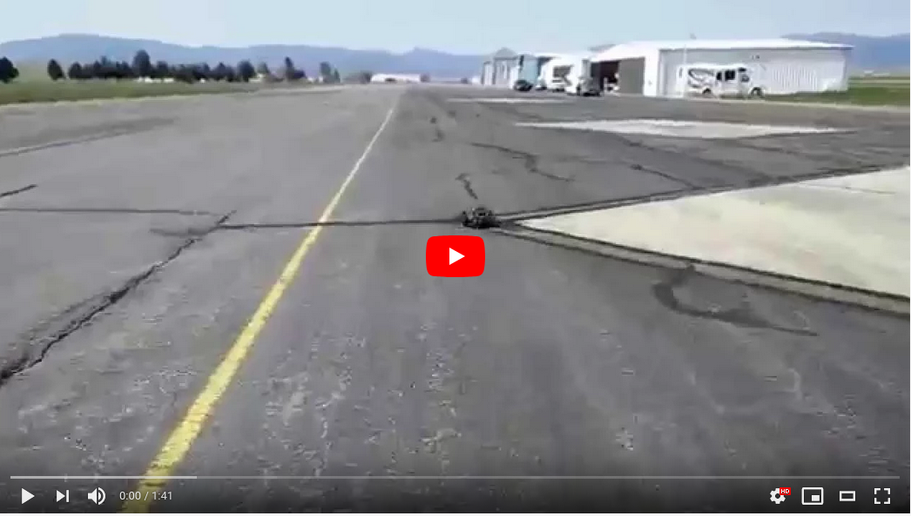
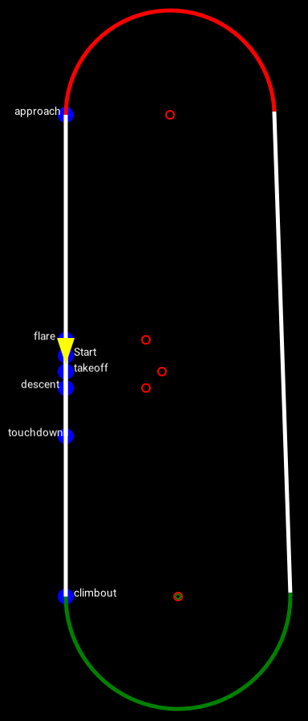
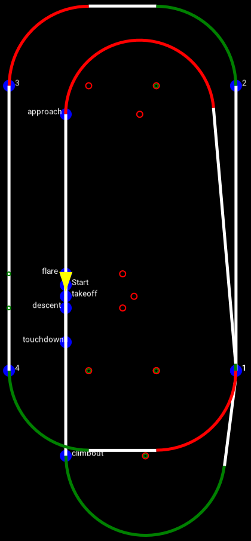
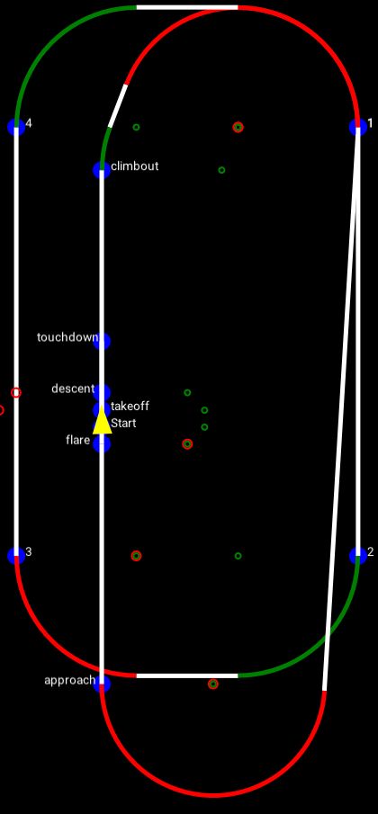
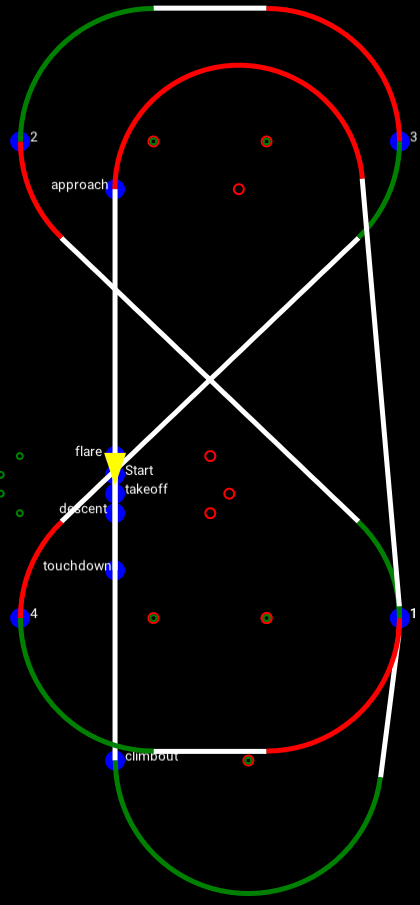
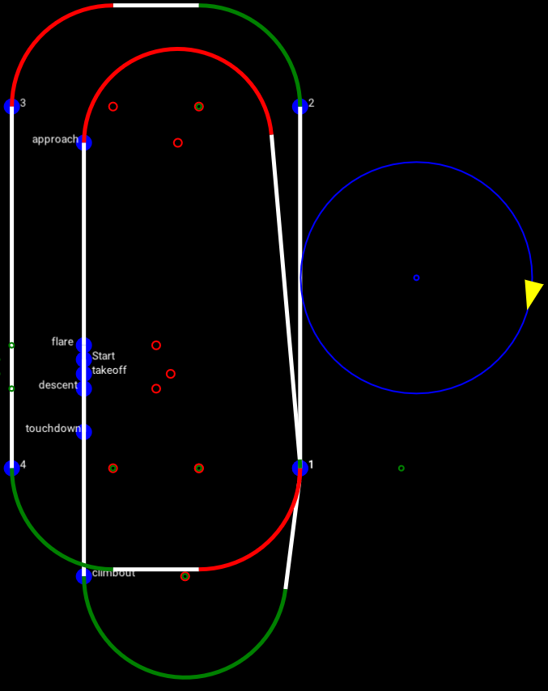
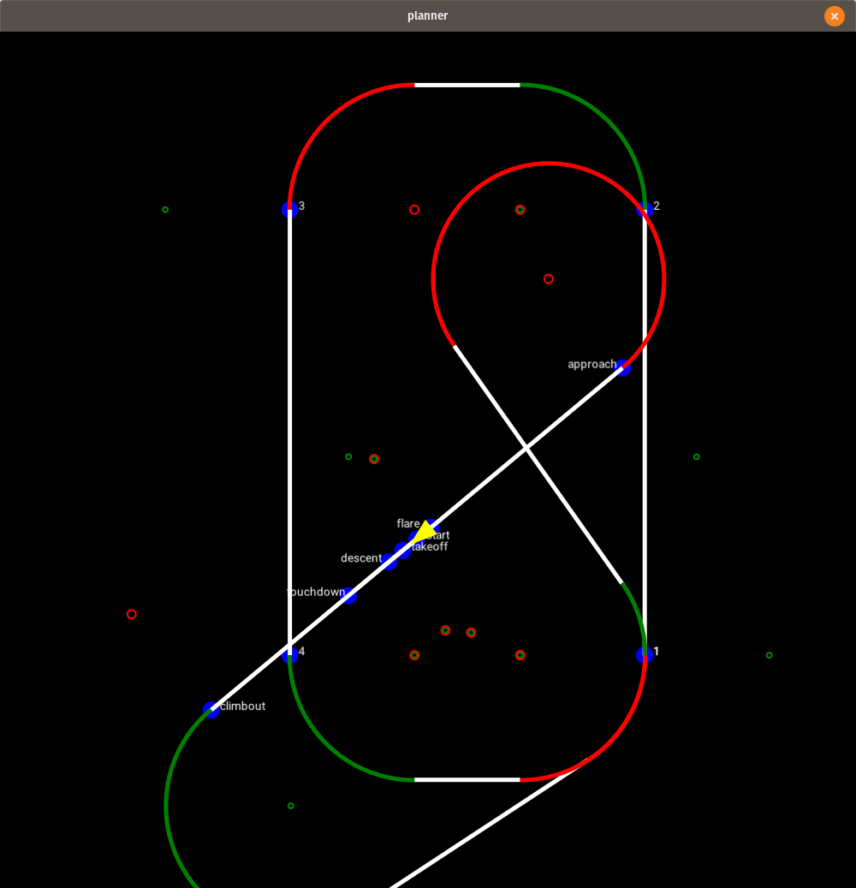
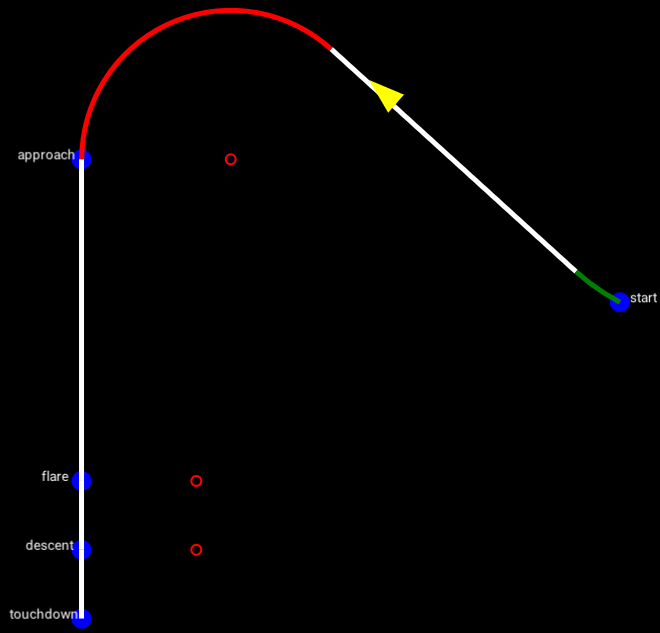

# 10. Plan it, Janet!
Is it weird that two of my favorite fictional characters are both named Riff Raff? Well, technically one them is real, but he goes so hard in the paint that he makes me wonder if maybe I'm the one who's fabricated.
[1](https://www.abouttoblow.com/wp-content/uploads/riff-raff-neon-icon.jpg) 

Unfortunately we're not going to be discussing the amazing freestyle that is "[Introducing the Icon](https://youtu.be/uzKFmq444O4)". Instead we will talk about the far less exciting topic of knowing where you are and where you're going (lest you end up someplace else). But don't worry, this is not a self-help seminar. Unless you are an autopilot, in which case the Singularity has arrived and I would like to be the first to welcome our robot overlords.
## They're All Going To Laugh At You
If there is one thing I can count on when it comes to testing my inventions, it's that they won't work on the first several tries. I remember the days before I had truly come to terms with this: I would test a prototype without any debugging tools installed, without any error logging, sometimes without even any failsafes. And then of course it doesn't work, so I would probably just, um, try it again? Yeah, super naive, and a huge waste of time. I also routinely failed to have clear success criteria, so at best I was hoping for some qualitative feedback. But as time goes on, and your "friends" keep giving you "constructive criticim" that makes you "cry", you start to learn some things. One tactic that I have grown fond of when it comes to testing vehicle control systems is using repeatable test plans. This is by no means revolutionary, but I believe it is a strategy that can be very useful even for vehicles that are not meant to be autonomous. By that I mean, if I want to collect metrics regarding my vehicle behavior, I likely can get better (and faster) results by repeating a test *exactly* over and over, rather than performing many different tests a few times. It's essentially the Bruce Lee approach to flight test.
[2](https://media2.giphy.com/media/mKPTMhAlmhlRu/giphy.gif?cid=ecf05e47422584188641f77c901febde712d6bd851aa7b66&rid=giphy.gif)

And how can you practice the same <del>kick</del> flight 10,000 times? Well, for starters it helps if your vehicle has an autopilot rather than a human pilot (**EVEN** if your final product will be controlled by a human). And secondly, you'll want the ability to generate those repeatable tests quickly.
## The First Flying Car
The smartest decision I made when developing my first autopilot (it's a short list) was testing my path following algorithms on a car before they were put on an airplane. Okay, technically that was only necessary because I made the dumb decision to not use any sort of simulation, but please remember how little I knew at that point. There is one tremendous advantage that ground testing has: you actually know where the vehicle is. If you are flying an airplane, you know where you *think* it is. So when we're trying to drive back and forth between two waypoints that happen to have a big yellow line connecting them, it's pretty easy to tell if our car is on the line or not (at least within the error expected by our GPS).

Once we graduate to the sky, it's anybody's guess. We at least have a pretty good idea on takeoff and landing, so once our high level controller is tuned to satisfaction, that's a great place to start. The nice thing about simulators is that you can spawn your aircraft in the same place every time. This means you can hard-code your start position for a given airport and runway (we'll get to adjustable start positions later). If we know our initial position and heading, we can calculate the entire takeoff and landing sequences relative to that point.

This mission is about as simple as it gets. Start the takeoff roll, leave the ground, climb to our mission altitude, and then come around to land. Although basic, it allows us to stress all of our controllers, particurlarly the altitude controller, as we have several different altitudes that must be achieved at specific locations. For example, if the aircraft hits the ground when it is supposed to be at the flare altitude, then we know our controller is overshooting. What's nice about this mission is that it is essentially the shortest path to a landing approach, aside from spawning our vehicle in the air (which seems complicated, although probably not impossible). Once we've got the takeoff and landing down, we can move on to some additional flight waypoints. If you'll recall from our discussion about Dubins paths, a racetrack pattern is a very simple way to test your path planning/following logic, as it only incorporates one of the four Dubins-type waypoints (*left-left* or *right-right*). When those look good, I like to try an hourglass pattern, which can utilize the same four waypoint locations, but will stress all four Dubins types.  
&nbsp;&nbsp;&nbsp;&nbsp;&nbsp;&nbsp;&nbsp;&nbsp;&nbsp;&nbsp;

## Going in circles

If this feels like a review, it is. But the paths are perhaps not as important as the progression we are following. Each mission is introducing a small amount of complexity, such that if vehicle does not perform as expected, we have a better chance of identifying the source of the error. We are also building a mission repertoire that will be very useful when it comes time to flight test. Before we ever need to start chasing down corner cases, we'll want to demonstrate that we can fly the same mission many times in a row without any issues. Speaking of that repertoire (whose first 'r' is <b>very</b> sneaky), wouldn't it be nice if we could tell the vehicle to just fly in circles? For one thing, it will help us to tune our orbit-following gains. It's also a great way to press "pause" in your simulation. And finally, this will be a useful feature down the road when we've got a camera onboard the aircraft and would like to observe something on the ground. Of course, if we have a mission loaded we don't want to throw it away just to orbit for a while, so the mission parameters will be saved and ready to resume once we're done orbiting.

## Lost in Earth
If you're like me, you get lost all the time. So the notion of having to repeatedly find the same exact hard-coded start location seems pretty daunting. I suppose you could place a big flag there, but then it would be in the way when it comes time to land and you'd have to remember to remove it. And while I'm sure you're thinking, "Who would be dumb enough to ignore a giant red flag?" I am. I am dumb enough. Now although I might not be capable of pinpointing my exact location, I can usually tell if I'm at the right airport. So what if we keep our flight waypoints fixed, but allow our takeoff and landing waypoints to move relative to our starting position? Then all we need to do is set the airplane down on the runway and point it in roughly the right direction. This was the strategy I used with my first autopilot, and it worked really well.

## Yeet on over 
But what if you're in the middle of a mission and something more important comes up?
[3](https://pics.onsizzle.com/bae-come-over-me-i-cant-amat-the-zoo-bae-2623471.png)

Ideally we wouldn't have to wait for the mission to complete. So the final addition to our planning toolbelt is a "land now" command. This creates a new Dubins path, with the vehicle's current location and heading as the first waypoint, leading directly to a landing.

## Moving Pictures
As awesome as it is to look at pictures of missions, I think a video might be a little more entertaining. But if I showed it to you now, you wouldn't need to come back next time. So instead, I will leave you with all the things that Meatloaf wouldn't do for love. See you soon!  -Greg