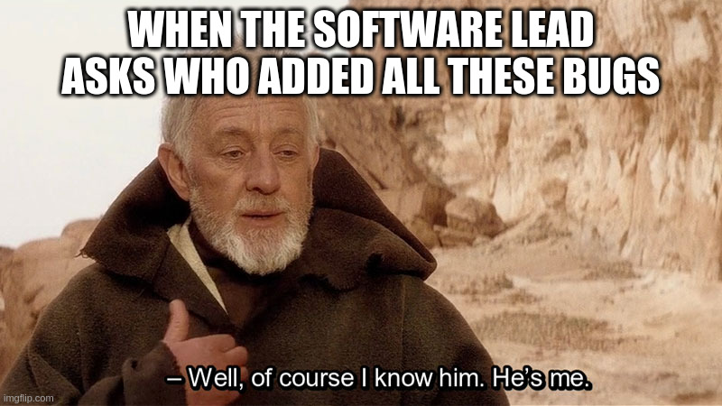

# 11. Kibbles 'n Wits

Welcome back! If you noticed that there wasn't a write-up last week when there should have been, then I think you're the only one. So congratulations, and please head over to the online store where you can pick up a free t-shirt using the coupon code THEREISNOSTORE. Unfortunately, I am still waiting on some new hardware to arrive that will allow me to illustrate the next step in the journey. So this post is a bit of an interlude, although it is still relevant to the autopilot development. We're going to have a quick discussion on the subject of **[dogfooding](https://en.wikipedia.org/wiki/Eating_your_own_dog_food)**. If you're not familiar with the concept (and have an aversion to hyperlinks), it refers to the practice of using (and relying on) the product you are developing. For example, if I were making an email client (is the name G-mail taken?), as soon as I had a viable prototype I would begin to use it for all of my emailing needs. And although I don't have much experience in developing customer-facing products, I can point to plenty of instances where I've been looking at a screen while yelling "Doesn't anybody at your company actually use this stuff?!?"

Even if you don't have customers, and are just writing code so that you can sound cool in conversations (with your mom, I guess?), it can be a useful exercise to approach your software (or hardware) from another perspective. In the case of this project, I found many opportunties for improvement when I began interfacing with the autopilot as a "third-party".
## Fonzie: Private Investigator
One of the few inviolable tenets of this Elixir autopilot is that it has a very clear and simple API (application programming interface). If the capabilies of the aircraft cannot be easily expanded through the use of third-party hardware and software, then we have lost one of the primary motivators for adopting this autopilot over other options. How can we make the interface as simple as possible? The first tactic might seem like it actually adds complexity, but I believe it ultimately contributes to the overall robustness of the system. I will discuss the reasoning for this decision in another post, so for now let's just pretend it's a good idea that we all agree with:
> All third-party software must be contained on separate hardware

The immediate benefit of this stipulation is that the autopilot source code remains untouched no matter what peripherals are connected. It also means that the peripheral software can be written in any language. In order to communicate with the autopilot, a device must simply adhere to the protocols of the API and be capable of UART read/write. This brings me to the actual topic of this post, which are the things I learned about my code when I tried to create a peripheral of my own.
## I blox, U-blox
If it ain't broke, don't fix it, and the UBX protocol from U-blox works just fine, so that is what I tend to use when I need to send serial messages. It is compact (8 bytes added to each payload) and there are plenty of example parsers available online. My first peripheral was going to be written in Python, which shares enough similarities to Elixir that I decided to port my Elixir parser into Python. Although porting code to another language probably doesn't count as dogfooding, I think it offers many of the same benefits. It forces you to understand what is happening with each line, and often times you will find opportunities for improvement in your original code (as was the case with this module). The nice thing about being your own first customer is that you can actually do something about the deficiencies rather than just be mad at them. Once I was able to create and parse UBX messages in Python, there was only one thing left to do: 
[1](https://media4.giphy.com/media/Lo0IDynmNuIv4WpYrl/giphy.gif)

Oh, right. I hadn't actually written the module in Elixir to interface with generic peripherals. While it might seem backwards to write the external code before internal code, it allowed me to create the ideal "customer" experience first and then adapt the API to match. To be honest, this led to a bigger refactor than I was expecting. Perhaps it would have turned out the same regardless of where I started, but I do like the idea of making the API conform to the use case, and so it was beneficial to create a peripheral while the API was still in its early stages. It was this "dogfooding" experience that really improved the Elixir code, and laid the groundwork for more powerful peripherals in the future. And once my new goodies arrive, I'll have a video for you that demonstrates the true potential of this Elixir autopilot project. Until then, just remember, your January diets will be a lot more successful if you pack on some extra pounds in December. So pay it forward and eat some extra cookies.  
-Greg