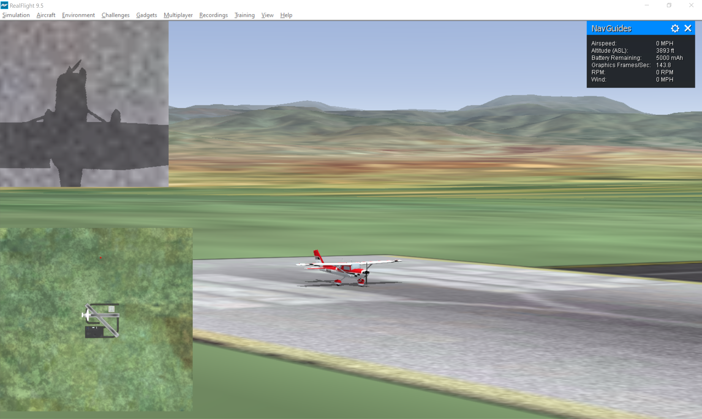
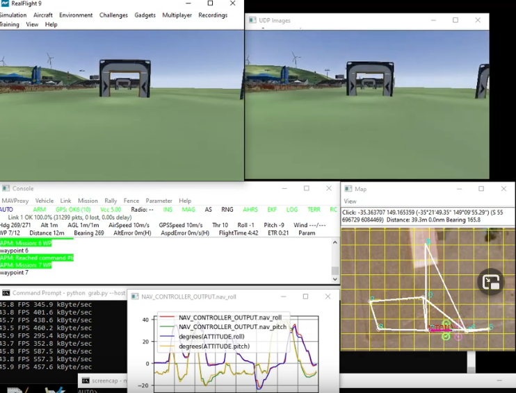

# 12a. Real to Reel
Welcome back, everyone! I hope you all enjoyed not leaving the house for the holidays. Isn't it crazy that people used to wear pants like every day? Wild.

During the break I finally got hold of the new computer I needed to help make this next demo possible. For starters, about a month ago I switched simulators, from X-Plane 11 to RealFlight 9.5. In case you're not familiar with [RealFlight](https://www.realflight.com/), it is an RC flight simulator, designed to recreate the experience of flying model airplanes (from the comfort of your home). If you've thought about getting involved with RC but don't know where to start, this is a great tool. It does an impressive job of replicating the RC experience, with the added benefit of not having to cry over all your crashed airplanes. But why did I choose to switch simulators? After all, you know I've cried plenty of tears over destroyed aircraft, so that ship has sailed.
* The aircraft in RealFlight are the same scale as the vehicles I will be testing in real life, so a controller tuned in RF should carry over well to a real flight test
* Flying from the RC pilot's POV (standing on the ground) gives an idea of how small the aircraft will look during a mission (one of the hardest parts of flight testing is recovering a vehicle that is too far away)
* Multirotor vehicles are available (which the Elixir autopilot will eventually be capable of controlling)
* Multiplayer is supported (this will allow for swarm logic to be tested)
* Additional cameras can be added to the vehicle (the purpose of this will be demonstrated shortly)
* If you get bored at work, you can play a video game and claim it's for research

Gameplay inside RealFlight is illustrated below. Notice the secondary view in the top left corner. This can be set to any of the camera views available in the game, but we're using the camera that has been added to our [E-Flite 2.1m Cessna 150](https://www.horizonhobby.com/product/carbon-z-cessna-150-2.1m-bnf-basic/EFL1450.html) and is pointed downward. This camera is simulating a third-party device that will be communicating with the autopilot and directing its flight path (but that comes later).

Pretty cool that we get to fly a simulated version of a model can we can actually own, right? Although, I suppose you could also own one of the aircraft in X-Plane, but I already spent my Christmas money on LEGOs, so I might have to wait another few years for that.

## SOAP City
As I'm SURE you recall from our posts about X-Plane, we communicated with the simulator by sending and receiving UDP messages. The good news is that RealFlight also allows us to control the vehicle with our autopilot. The bad news is that we have to use SOAP. \<insert joke about smelly computer programmers here\> 
Now I have nothing against [SOAP](https://en.wikipedia.org/wiki/SOAP) other than the fact that I had never heard of it before and I had no idea what the heck I was doing. However, Ardupilot has [proven](https://ardupilot.org/dev/docs/sitl-with-realflight.html) to be capable of integrating with RealFlight, so I knew it was at least possible (and I could use their source code as a starting point). In short, SOAP uses XML-formatted messages, which most often are transmitted with HTTP (as is the case with RealFlight). So the three challenges were:
* Determining which messages were available to send/receive
* Formatting the messages correctly
* Sending/Receiving messages using HTTP

My biggest gripe about the whole process was the lack of formal documentation from Knife Edge (the creators of RealFlight) regarding this interface (they call it FlightAxis). I think it is a shame, because they built a really wonderful feature that tremendously expands the usefulness of their software. But undocumented features are about as useful as I was from ages 12 to 27.
[1](https://i.imgflip.com/2t4wmk.jpg)

Once the FlightAxis message structure was understood, it was a matter of making HTTP calls on the Elixir side. This was quite simple thanks to the [HTTPoison](https://hexdocs.pm/httpoison/HTTPoison.html) library. Every time we would like an update from RealFlight regarding the state of the aircraft, we use the **POST** method. This results in a two-way transfer of data, as the **POST** request also includes the servo output from our autopilot (calculated from the previous update). RealFlight will then respond with the updated state of the vehicle, which we can format to simulate various sensor outputs like we did with X-Plane. In the end, it's pretty basic, with the majority of the code dedicated to extracting the aircraft state from the RealFlight response.

## Downward Vlog
Alright, so we've essentially gotten back to the same point we were at with X-Plane: controlling a simulated vehicle with our autopilot. Now it's time to enjoy the fruits of our labor (after some additional labors, of course). We would like to analyze the downward-facing camera feed from the perspective of a third-party peripheral. That is, each frame should be packaged so that it can be consumed as though it came from a real camera. Fortunately, Andrew Tridgell (the systems lead for Ardupilot) had already [demonstrated](https://www.youtube.com/watch?v=SDSxel3N1pw) this capability (which is how I got the idea in the first place).

By using the Python package [d3dshot](https://github.com/SerpentAI/D3DShot), we can grab a screenshot of our RealFlight environment (we'll take just the part showing the downward-facing camera feed), and then send this image data (encoded using OpenCV) over UDP. On another computer we can have a script running with a UDP socket open and waiting to receive these messages. This script is representing the third-party peripheral, which in real life would be capable of obtaining the video footage on its own. Nonetheless, the peripheral now has its data to analyze. The important thing to note here is that this peripheral is self-contained. It is not part of the autopilot (it's written in Python, for one thing), and thus its hardware and software can be developed without any integration concerns, provided that it conforms to the autopilot's API. So while this "peripheral" currently exists on the same computer that is running the autopilot, this is by no means a constraint, and it will soon be moved to a separate piece of hardware.   
So what, you may ask, it the point of this peripheral? Well, that will just have to wait until next time. But I think it's pretty cool, so hopefully you'll come back to check it out.  You're very patient, dear reader. That's what I appreciates about you.  -Greg