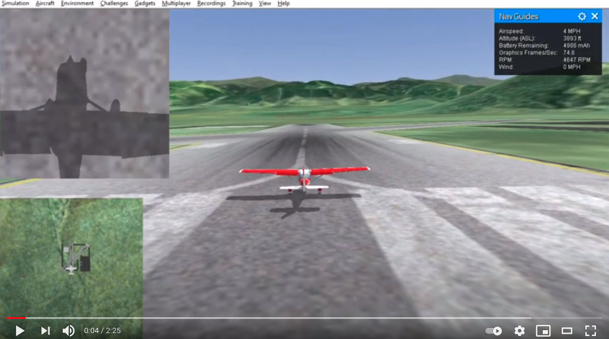

# 12b. A Eye in the Sky
Welcome to the thrilling continuation of our RealFlight simulator discussion. If you remember from last time (I had to go back and look too), we were able to capture video from a downward-facing view in RealFlight and transmit its data via UDP. These images could be collected by a separate script, thereby creating the presence of a third-party "camera". Now we will actually put that camera to work. To give you some context, here's a quick glimpse of what the camera sees on takeoff:

Now somewhere out in the grass lies a giant red circle. Our camera has been equipped with a clever algorithm to identify this red circle and tell the aircraft to orbit around it. You know what's cool about game engines? The pixels are perfect. So it really only takes like 4 lines of OpenCV code to find the circle. The hardest part is calculating the distance from the aircraft to the circle (which I don't think I got exactly right, so it's a little twitchy). But once the circle has been found, the aircraft will continue to orbit as long as the camera continues to send commands, or until the GCS operator overrides the camera's permission to control the vehicle. In the future, the autopilot could also ignore a peripheral due to other circumstances, such as the need to land before the battery runs out, but that has yet to be implemented. Below is an illustration of the orbit that is added to the aircraft path planner, as well as a sped-up version of the object acquisition and subsequent orbit. After that is a dog playing hockey, because if you watch the airplane circling that dot for too long you're going to throw up. 

 
[1](https://i.imgur.com/FvrzOHA.mp4)

## But whai?
The object circling kinda looks like a record, right? Well good, because at this point I should be sounding like a broken one. What is the point of all this? 
> The peripheral is modifying the behavior of the aircraft in real time.
 
Or to quote Ron Popeil:
[2](https://youtu.be/GG43jyZ65R8)

Obviously, we can't completely forget it, but it does mean that the operator need not be involved in every decision that affects the path of the vehicle. In fact, we can have peripherals that might outperform their human counterparts through the use of coding and algorithms.
[3](https://img.ifunny.co/images/c8747af585d04da048efcc0befa382a044c065db00b435e362c438bb20da22a6_1.jpg)

Our red circle example may be trivial, but it demonstrates a great use for this autopilot when equipped with a smart camera. A potential search and rescue mission plan could be as follows:
<ol>
<li>Roam search area using predetermined path (alone or in conjunction with other vehicles)</li>
<li>If camera finds something of interest:</li>
<ol type="a">
  <li>Orbit at location</li>
  <li>Alert operator and provide data for analysis (video feed, still images, etc.)</li>
  <li>Operator can choose to:
    <ol type="i">
        <li>Confirm that the subject has been found</li>
        <li>Adjust the vehicle position for more information</li>
        <li>Dismiss the vehicle to continue its search path
    </ol>
</ol>
</ol>
The advantage of this method is that someone doesn't have to be staring at a video monitor for hours at a time. For one thing, this would require 100% video stream uptime to be effective. And besides that, unless there's a car chase or a bar fight every 15 minutes, who can pay attention to a screen for that long? We can utilize machines for what they're best at: computationally intensive tasks, complex data fusion, and multi-sensor analysis. Meanwhile our brains can be used where machines are weakest: high-level decision making. The peripherals augment the autopilot, the autopilot augments the vehicle, and the vehicle augments our mission capabilities. That gets me pretty excited, and I've seen a man roast four juicy sirloin steaks without even paying attention, so I know a little something about excitement.  
In case you want to watch the results of somebody else's video game (it's like Twitch, but without action, sound, or commentary), click on the picture below and you can check out "The Hunt for Red Dot-ober". But if not, there's no hard feelings. I'll shee you shoon.  
-Greg

  