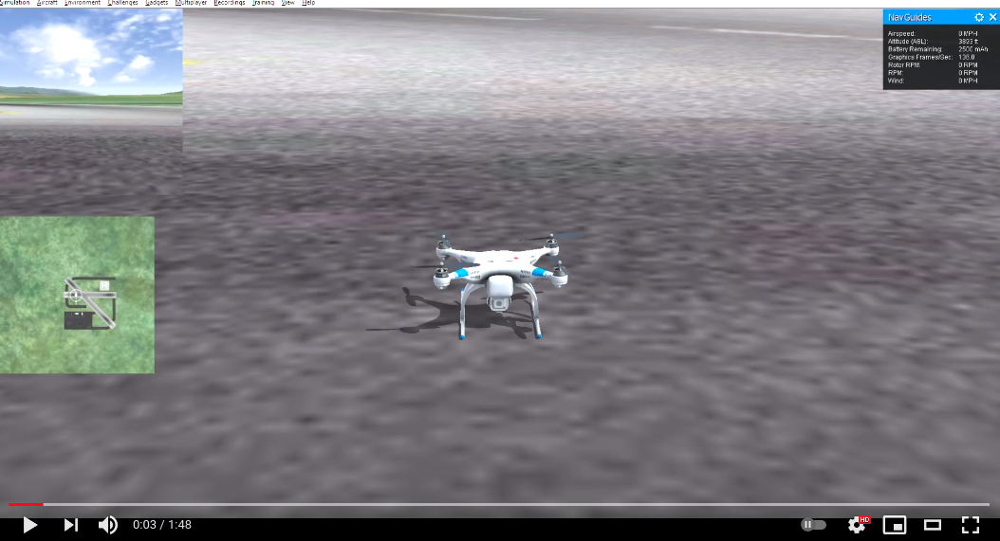

# 13. 1+1=1
No need to pull out your calculator, folks, the math here isn't literal. Today we're talking about how it was possible to add a multirotor controller to our fixed-wing autopilot in just 4 days thanks to the awesomeness of Elixir. Now, if you're thinking "4 days is not nearly enough time to make a good multirotor controller", you're absolutely right. Let's call it the *Little Caesar's Hot-N-Ready Controller*.<p align="center"></p> 
I mean, I absolutely love their pizza, but certain (former) friends of mine... Anyway, just to prove that the controller isn't terrible, I offer you a video of this quadcopter flying in RealFlight. It's the same mission as the one we've used for our Cessna 150, with a bonus orbit added in the middle. But if you don't have two minutes to spare, I'll save you the trouble: it flies just fine. Would I trust this controller on a real quadcopter that had real rotor blades that made real cuts when they hit your real face? Probably not. Mostly because it lacks all the niceties that a mature controller would have to protect you from your own incompetence. But it's good enough to demonstrate the concept, and that's all I care about at the moment.
<br><br>[](https://youtu.be/ItGxSKOme6Y?t=3)<br>

## The One-Eyed Man
Full disclosure: I am not even close to an authority on this subject. I wouldn't be the least bit surprised if I'm butchering the Elixir language with how I'm using functions. But it seems reasonable to me and it appears to be working, so for now... wheeeeeeeeeeee.<br><br>
From the beginning this autopilot was intended to control different types of vehicles. The first prototype was actually a ground vehicle controller, because those tend to fall out of the sky much less. This meant that vehicle-specific parameters were already broken out into separate folders and functions. The model name is specified by a single file located on a USB flash drive installed in the Raspberry Pi (because we don't want to touch our source code, right?). When the autopilot first boots it checks the name of this file, i.e., "Cessna150", and then loads the appropriate configuration. For one thing, the autopilot will know that it is an airplane. Other pieces of information include the PID controller gains, vehicle turn rate (for planning purposes), and controller limits (rate, attitude, speed, etc.). The type of vehicle is passed to every module that might need it (the Cessna 150 is a "Plane"). At this point we can take advantage of the Elixir function `apply`, which allows us to call a function whose name and location (module) can be specified at runtime. In other words, if I have a function called `add` located in the `Math` module, we could expect that:
```
apply(Math, :add, [2,3]) = 5
```
Or if we had two controllers, one for a Plane and one for a Multirotor, as long they each had a function called `fly`, the following code blocks would both be valid
 ```
apply(Plane, :fly, [1,2,3,4])
apply(Multirotor, :fly, [1,2,3,4])
```

But now let's abstract the vehicle type to actually take advantage of the runtime aspect:
```
vehicle_module = Plane
apply(vehicle_module, :fly, [1,2,3,4])
```

See how easy that was? Now everywhere that we have vehicle-specific instructions we can call the correct function according to the vehicle type. This means that our code isn't littered with conditional statements like:
```
if (vehicle_type == Plane) do
    fly_like_a_plane(1,2,3,4);
else if (vehicle_type == Multirotor) do
    fly_like_a_multirotor(1,2,3,4);
end
``` 
Of course, most of the autopilot code is vehicle agnostic, so it remains untouched. But in the future if we decide to support a new type of vehicle (autonomous unicycles, anyone?), we won't have to tear everything apart. Hence the funny math at the start of this. We can add support for an entirely new vehicle without a tremendous amount of effort (assuming we already understand the logic for controlling it). So it's more like `1+1=1.05` but our editor, O'Brien, said that either one is fine.

## What's next?
There is one task that we have yet to complete with this autopilot: fly a fully-autonomous mission with a real vehicle. Our priority has been simulation as of late, but our 2.1m Cessna is just about ready to go, so once the weather gets to 80&#176; I'll be able to stand outside without whining and we'll fly this thing for real. See you soon!<br><br>-Greg<p align="center">[1](https://media1.tenor.com/images/511960e849769ffcc6e536e390f9810d/tenor.gif?itemid=17644004)</p>