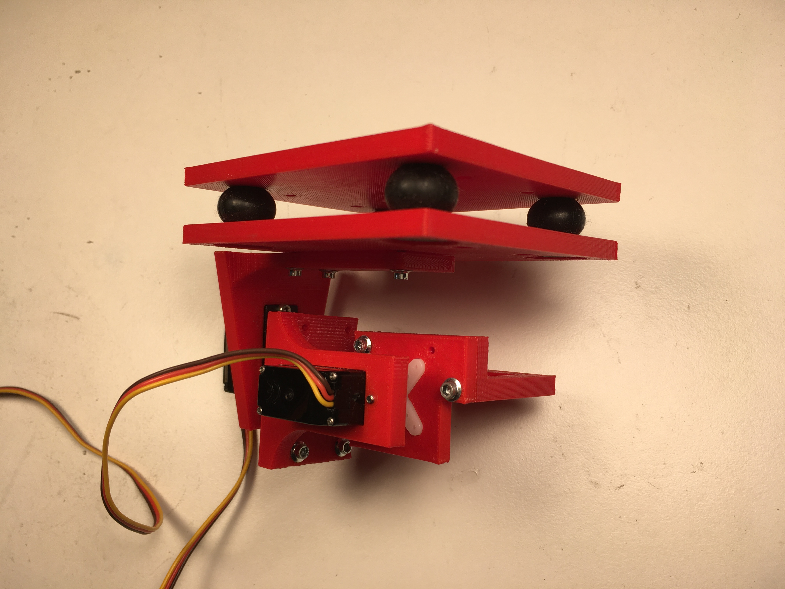
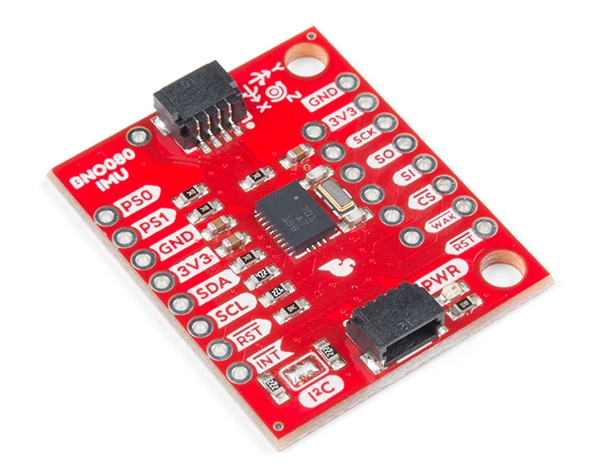

# 1. Hardware vs. Software
Software is great, but at some point it has to interact with hardware or it's useless. One of the pressing questions early on was how many of the hardware interfaces could be written in Elixir. For example, the first peripheral I wanted to test out was an IMU (inertial measurement unit). If I were working with Arduino, I would have a library already available, ready to plug and play. 
> Should I connect the IMU to an Arduino board, and then interface with the Arduino board using a serial protocol of my choice? Or does the extra hardware outweigh the benefits of ready-to-use software? 

Since I was still very new to Elixir, I thought it would be interesting to replicate one of my previous projects that had utilized Arduino, in this case a 2-axis camera gimbal. Do I have pictures of the original? *No*. Did I take pictures of the Elixir version before I took it apart? **Also no.** So we'll have to use our imaginations. (Don't worry, I hear your boos and I agree) All I can offer is a lonely image of the gimbal. Can't you just picture all the cool electronics hooked up to it? Doesn't it feel alive?? Wow. Goosebumps. 

The first step was to write a driver for the IMU (I was using the BNO080 from Bosch, which is available on a [breakout board](https://www.sparkfun.com/products/14686) from Sparkfun.

I opted to first try an I&#x00B2;C driver. After many frustrated hours of the board locking up on me, I discovered that the Raspberry Pi I&#x00B2;C bus is not capable of clock stretching, which is apparently a thing, and something that the BNO080 requires. So...not a great start to the "write your own driver" experiment. 
I switched to their UART protocol, and was eventually able to interact with the sensor. But the process was painful (especially knowing there was a perfectly good Arduino library just begging to be used), and I hadn't even started to port my IMU algorithms from C++ over to Elixir. To make things a little easier, I used the BNO080's ***AR/VR Stabilized Game Rotation Vector*** (described somewhere in [this](https://cdn.sparkfun.com/assets/2/b/9/0/6/DS-14686-BNO080.pdf) datasheet), which provides roll, pitch, and yaw right out of the box. The 3-axis gyroscope outputs were also easy to grab. 

The next step was a driver for my servo controller: Pololu's awesome little powerhouse, the [Micro Maestro 6-Channel USB Servo Controller](https://www.pololu.com/product/1350). These are available with 6, 12, 18, or 24 channels, and are *very* convenient when you need to drive some servos from a computer. For those of you who like results without the hassle, they've got a GUI for Windows and Linux :grinning: 

The [user's guide](https://www.pololu.com/docs/0J40) is comprehensive, and made writing a driver pretty painless. It probably helps that there is no handshaking required in order to send commands to the Maestro. You could operate purely in a one-way fashion, although it is possible to query the device for the status of several parameters.  

With the interfaces taken care of, all that was left was the controller, which was very basic and not that interesting. But for now we're just going to pretend that it was awesome and super performant. Bonuses all around! 

# Did we learn anything??
So I basically have two data points: One difficult experience and one easy experience. I think this tells me two things, or maybe two sides of the same coin. 
> Write the simple drivers in Elixir and leave complex drivers to the microcontrollers.

## <ins>The case for Elixir drivers</ins>
* We can reduce the number of hardware components.
* Third-party drivers often include far more features then we'll ever use. More code usually means more potential for bugs.
* Writing drivers is a great way to get more comfortable with an ecosystem!
## <ins>The case for microcontroller drivers</ins>
* Complex drivers tend to involve setting a bunch of configuration parameters. This is tedious to replicate for ourselves.
* We can choose the appropriate microcontroller for each application. 
* If we want to change peripherals later on, we can do this with much less effort. The library already exists (although the limit might not).
* One microcontroller can be used to handle multiple functions, so we might not be paying such a huge price in terms of hardware count.

# Conclusion
One of the biggest factors in the **Hardware** *or* **Software** decisions is ***Time*** (can you tell I'm just learning Markdown?). The quicker we're trying to move, the more we will rely on pre-existing solutions. The interesting part of this autopilot is not the servo controller or the IMU algorithm, so why should we spend unnecessary effort getting these to fit in the smallest packages with the fewest lines of code? Treat everything as though it will be replaced at some point, because that is probably the case. Of course, we're trying to get the current prototype to be as represantive of the final product as possible (we don't want to be testing junk), but we must accept the fact that we will change our minds **A LOT** on this journey.
Oh, hey, look! Here's a video of a different gimbal using a different controller that I didn't write any code for. Please come back for the next post...:disappointed_relieved::disappointed_relieved::disappointed_relieved:  
-Greg

