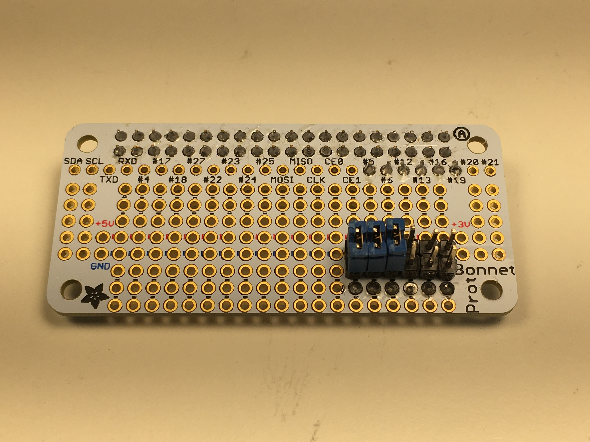

# Code for any Mode
From the start, this autopilot was designed to use multiple nodes operating on a local network. And with that premise in mind, I introduce you to Segal's law (not to be confused with Steven Seagal's [*Above the Law*](https://youtu.be/BsbYE-Q474I)).

 
## "A person with a watch knows what time is it. A person with two watches is never sure."

And here lies perhaps the biggest issue when it comes to multiple devices working together: 
> If two devices disagree, how do you know which one is right?

I'm sure there's a lot of really clever answers to this, but the nature of Elixir allows for an answer that is simple. And I like simple.
> If a device is alive, assume it's right.

To make this work, we must embrace the "[Let It Crash](http://stratus3d.com/blog/2020/01/20/applying-the-let-it-crash-philosophy-outside-erlang/)" philisophy of Erlang/Elixir. Essentially we design our software for the best case scenario, and maybe a few exceptions here and there. But for the most part, if something weird happens, we let a process crash so it can restart with a clean state. I realize that the concept of a `Process` in Elixir terms is probably foreign to most of you. Rather than butcher it, I will guide you to one of the best resources in the Elixir community, [Saša Jurić](https://youtu.be/JvBT4XBdoUE). But if you don't want to watch a video, then just think of a `Process` like a `Thread`. You can have a bunch of them, and they can all be alive at once, each taking their share of the CPU. The BEAM virtual machine does a great job of handling resource allocation, so you can be confident that each `Process` gets its fair share of clock cycles. And if a `Process` is supervised and it crashes, then its `Supervisor` will restart it shiny and new. It will, in fact, [buy it a new life](https://youtu.be/W05cPXpUHGI).  
Okay, back to the crashing. The ultimate means by which the autopilot achieves its goals is through physical mechanisms: actuators, motors, ion thrusters, etc. If we want to have multiple inputs (commands) to a single output (motor), then we need a device that will choose which of the inputs to use. Luckily that's, like, totally a thing. Enter the [Multiplexor](https://en.wikipedia.org/wiki/Multiplexer) (also spelled Multiplex**e**r, but that's way less fun). The multiplexor chooses between two input signals and forwards only one of them. And how does it choose?? We make it easy:
* If the primary signal is present and valid, use it.
* Otherwise, use the secondary signal. 

There is no voting or averaging or ladder matches for the WWF Intercontinental Championship. If the `Process` is alive and capable of sending a signal, we trust that it is a good signal. In other words: If I fits, I sits.

This decision has a very nice byproduct: The code on every device can be identical. Sorry, let me repeat that for those in the back. 
## **The code on every device can be identical.** 
If the signal routing is being done by an external piece of hardware, then each node can behave as though it were the only node. Of course, the tasks it must perform will be determined by the peripherals to which it is connected, but we will see how that works later. For now, we can take for granted the fact that our code will not be riddled with `if/else` or `switch` statements (or the Elixir equivalent of these) to deal with every possible type of node. This makes it so much easier to build a network. The only thing a node needs to know is where it fits in the system, i.e., what hardware is it connected to. This will define its responsibilities.  
The first way I differentiated nodes was through the GPIO (General-purpose input/output) pins. By connecting certain pins to GND via jumpers, I could create a node ID by means of binary addition. For example, the board below would be representating *Configuration #7*, as pins for the 0, 1, and 2 bits were closed (the 0-bit is on the left in this picture)

I later moved to defining the nodes using a USB flash drive, but at this point I was using a Raspberry Pi Zero, which does not have USB-A ports (unless you attach them). So the node responsibilies were hard-coded, e.g, *Configuration #7* might the node that communicates with the IMU and then passes the parsed data on to the rest of the network. Obviously this hard-coding was less than ideal, but in the beginning when the project was small and I was still very new to Elixir, it did the trick.  

The mention of an IMU might trigger a thought for you: If we can have multiple software outputs to hardware, can we have multiple hardware inputs to software? In other words, could I have two IMUs on the vehicle? And if so, how would they interract/deconflict? Such a great question! In fact, it's so important I will talk about it in the next post, because this one is already a bit long. Come back next time and we'll discuss how to tell time with two watches, which is what I thought I would be doing with the post. Mediocre.  
-Greg