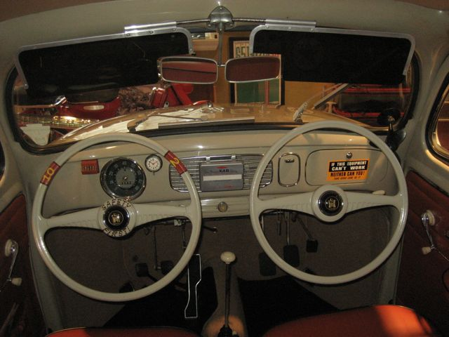
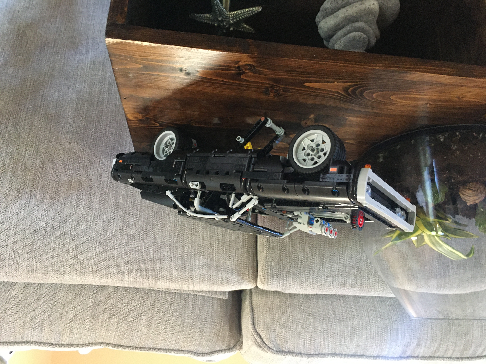

# 3. Commands on Demand
Welcome back! Unless you never left, in which case, maybe it's time for a snack?? Previously we were discussing the notion of taking two sources of hardware output and somehow rectifying them into a single software input. I used the example of two IMUs, but I'm going to retract that one for now, because I haven't actually duplicated sensors on the vehicle yet. Rather, let's talk about using multiple sources of vehicle commands, since I've at least got that much working. But 2021 is the year of redundants sensors! (or should I call them oxiliary?)
 *Pesky front seat drivers...[1](http://tedsmakemyday.blogspot.com/2011/12/tales-of-durable-volkswagen.html)*

## Two is one
I've never tested an autonomous system that lacked the option for a human operator to assume manual control. I know there are aircraft out there where the pilot is like my days in the middle school social heirarchy (permanently out of the loop), and to be honest, that is terrifying. Kudos to anyone that's launched an aircraft when the autopilot was the only thing that could bring it home. But for us mortals, we would like to have multiple ways to inject vehicle commands. If it were only about choosing between the human on the ground and the computer in the air, a simple boolean would probably be suffient. `if(pilot): tell computer to shush`. 

But remember, one of the most powerful features/goals of this autopilot is that we can take commands from anyone, whether that is a human, the onboard autonomous navigation system, a third-party object-tracking camera mounted on the aircraft, the autonomous navigation system from another aircraft, etc. Obviously we can't have an ever-growing list of cases to consider inside the code, as that would get tedious real quick. The solution I implemented suffers from the classic **"I'm going to use this for now, but surely it won't persist for the entire lifespan of the code, right? RIGHT?!?"** So, it's due for a refactor, but it's worked well enough so far. 

> Note: From here on out, I will be using Elixir-related terms when describing code. In the beginning I will do my best to related them to object-oriented languages, but I think the meanings should be clear enough given the context. 

## Message Polyglottal 
I have a module (class) in my code called `MessageSorter`. Every instance of a `MessageSorter` process corresponds to a message type. For example, I might have a `MessageSorter` that contains information pertaining to the vehicle's attitude commands. Let's call it...`attitude_cmds`. Any process (thread) can publish a value to this `MessageSorter` and it will store it, provided that three pieces of information are included:
* Value
* Sender classification (an older message from the same sender will be updated with the new value)
* Time validity (how long is this value usable?) 

A process can request the current value of the `MessageSorter` at any time. This will trigger a few actions:
1. Prune any expired messages from the list
2. If there are any valid messages left: 
    a. Sort the list according to classification 
    b. Return the value of the message with the highest priority
3. If no messages after Step 1, return the `MessageSorter` default value. 

I'm sure many of you balked at Step 2a. Yes, this could result in a lot of sorting. I've got two pieces of good news: For one thing, Elixir has a built-in sorting function (although I do have a pretty sweet algorithm that can almost achieve O(n&#x00B2;) performance). Secondly, there will be at most two messages in the queue (I counted!), because each `MessageSorter` only has one or two sources (for now). So maybe this won't scale, but in the past I have thrown away a lot of time worrying about the problems down the road, often to the point that I never actually got to them because I failed to handle the immediate issues. In the meantime, let's pretend that we're watching Brian O'Connor shift through 12 gears and then finally decide to press the pedal **all the way down**, because sometimes it's just more fun to accept the premise.
[2](https://cdn1.thr.com/sites/default/files/2013/05/screen_shot_2013-05-06_at_5.04.27_pm.png)

## The Fast and Mercurius
Alright, back to our example. At this point in time, attitude commands can come from two places: the autonomous navigation system (which I call the `Navigator`) and the human pilot (which I call handsome). Although I super duper trust my code, I have the human pilot commands set with a higher priority than the autopilot. In the event that both values are present in the `attitude_cmds` sorter, then the manual commands will be used. The nice thing here is that if the pilot takes control of the vehicle while the `Navigator` has an active flight plan, the `Navigator` will continue to process data and send commands. In other words, it doesn't know that it's being ignored. If the pilot relinquishes control back to the `Navigator` it will resume the mission at its current position, having accounted for any waypoints that were completed by the manual pilot. And how does the pilot relinquish control? They just stop sending commands. Don't worry, they don't have to pull out all the RC transmitter motherboards like when Boris gets spiked by Natalya Simonova (apparently "chair" is not a strong password). Instead one of the RC channels is dedicated to setting the flight mode (manual/auto). If the mode is in "auto", then the pilot's commands are not sent to the `MessageSorter`. 

This `MessageSorter` logic is utilized throughout the autopilot pipeline. In many cases there is only a single source of data, but the `MessageSorter` can still be useful, given its ability to select a default value in the absense of a valid message. This is great for the `Actuation` module, which handles the motor and servo commands. When the autopilot first boots up, the motor and servos will be sent their default values (motor off, control surfaces neutral), and they will continue to receive these commands until either the pilot gets involved or a mission is loaded. 
Like I promised at the top, eventually we will be able to utilize redundant sensors, using the same "if it's alive, assume it's good" logic. But at the moment, I can barely fit all my hardware in the aircraft when there's only one of everything, so sensor redundancy might be in the backseat for a while.  

## Out of gas?
Yeah, me too. How did you get down here so fast? You skipped a few sections, right? Probably a good choice. I mean, after all, winning is winning. 
Next time we'll talk about something a little less abstract. Or maybe I'll just show off some of my latest LEGO builds. But just in case I pick tricks over bricks, here's something for the road. 

-Greg

