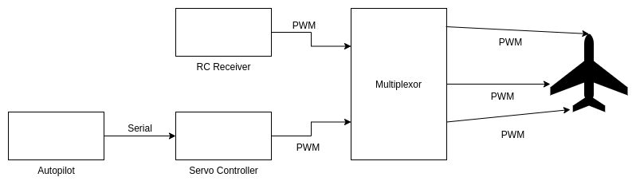
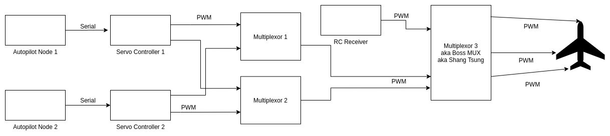
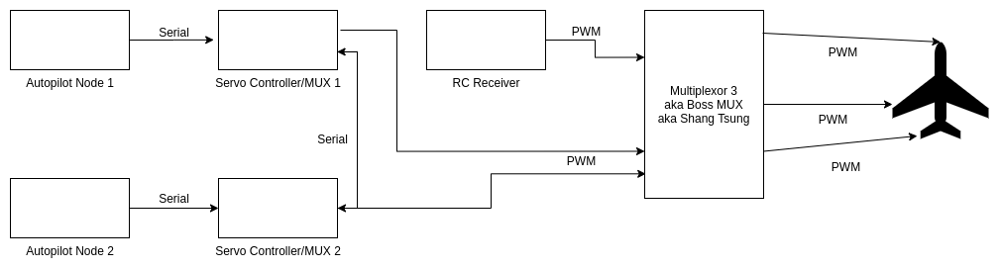

# 4. Attested Development
Do you ever look back on your life and think: 
[1](https://giphy.com/gifs/11BAxHG7paxJcI)

Great! Me too. And even though I'm constantly convinced I've made it to the other side of *senseless*, I continue to provide examples of the contrary. Today I figured we could talk about one such instance involving our good friend, the ***multiplexor***. 

As I'm sure you remember from Part 2, a multiplexor takes input signals from two different sources, and based on some criterion passes only one of them on. This is a very useful tool, as it allows for a direct link between the RC receiver and the servos in the vehicle. If things go south with the autopilot, I can simply switch to manual control, which gives me that extra bit of comfort as I manually pilot the airplane directly into the ground due to poor decision making. 
Things got a little more complicated when I added a second node to the autopilot. Before the servo signal reaches the final multiplexor (which I'm tired of typing, so we'll call it a MUX from now on), there must first be a decision as to which of the two node's signals will be used. If only there were a way to choose between two input signals...That's right! More multiplexors. I mean MUXs. MUXes? MUXi? So basically this autopilot is just turtles all the way down. Perhaps a diagram will help. Let's start with the single-node configuration (created using https://app.diagrams.net/, formerly http://draw.io)

> In case the acronym *PWM* doesn't ring a bell, it stands for "[Pulse-width modulation](https://en.wikipedia.org/wiki/Servo_control)" and is the type of signal that a servo expects to receive. The fact that I'm sending PWM signals to the MUX is important to note now, because that will change later. 

So the aircraft servos are connected to the MUX which is either forwarding autopilot servo commands or RC receiver servo commands. This is pretty simple, and it led to the following hardware stack: 

The RC receiver is on top. Below it is an [Adafruit Feather M0 Basic Proto](https://www.adafruit.com/product/2772) board, loaded with a program that takes serial messages from the autopilot and converts them to PWM signals. In the bottom right is a [4-channel MUX](https://www.pololu.com/product/2806) from Pololu. You may notice there are two yellow/red/black servo connectors coming out of the receiver and exiting to the right (stage left). These were connected directly to the aircraft flaps and landing gear, as this MUX does not have enought channels to support them. 
This setup isn't too bad. The wiring is pretty much as minimal as it could get. But when we expand this design concept to the dual-node configuration, things get ugly. Let's look at the diagram:

YIKES. My guess is you didn't bother to look at it closely, and honestly neither would I. But you at least noticed all the extra lines and stuff, right? So why are they necessary? Well, each of the autopilot nodes has two responsibilies:
1.  Act as primary source for approximately one half of the servos
2.  Act as secondary source for the rest of the servos

This is the reason there are two MUXes before we even get to the final Boss. MUX 1 and MUX 2 each supply roughly half of the servo outputs, which are combined into a complete input for MUX 3. Perhaps a few scenarios will help. Let's assume that MUX 1 is responsible for channels 1-3, and MUX 2 is responsible for channels 4-6.
### Scenario 1: Normal Operation
* MUX 1: uses **primary** inputs, coming from Autopilot Node 1
* MUX 2: uses **primary** inputs, coming from Autopilot Node 2

### Scenario 2: Autopilot Node 1 is dead
* MUX 1: uses **secondary** inputs, coming from Autopilot Node 2
* MUX 2: uses **primary** inputs, coming from Autopilot Node 2

### Scenario 3: Autopilot Node 2 is dead
* MUX 1: uses **primary** inputs, coming from Autopilot Node 1
* MUX 2: uses **secondary** inputs, coming from Autopilot Node 1

So as long as one of the autopilot nodes is healthy and producing servo commands, all of the servos will be covered. But still, this is a pretty dense solution. Steve Holt!

> In this example, servo control is coming from Pololu [Maestro Servo Controllers](https://www.pololu.com/product/1350). This setup was actually created before the single-node setup mentioned earlier, so the chronology is a bit out of order here. The next revision we see will again feature the Feather M0. And if you're looking for the RC receiver, it's hiding under the monster [8-channel MUX](https://acroname.com/store/s56-rxmux-1) from Acroname. 
## Where did we go wrong?
How did the addition of just one more node turn this solution into such a hardware nightware? Allow me to highlight the assumptions that were carried from the single-node setup to the dual-node setup.
[2](https://i.pinimg.com/originals/58/03/1b/58031bef9a023a631b17e34884a7e18c.jpg)

The requirements had changed, but I did not revisit any of the decisions that went into the design of the single-mux configuration. I just took that concept and made it bigger. The two most impactful assumptions were: 
  
  1.  I need to use a dedicated servo controller to produce PWM signals
  2.  I need to use an off-the-shelf MUX rather than create my own

Assumption #2 was somewhat of a byproduct of #1. If I'm using a separate PWM controller, than my signals will be PWM, and therefore an off-the-shelf MUX makes total sense. But what if I could use a microcontroller to generate PWM signals? Could I also use that board to act as a MUX? And if my MUX is on a microcontoller, do I need to send PWM signals to it, or I can use something more versatile, like UART? Great questions. Here's the updated diagram with the answer:
 Dual-MUX with Arduino

As you can see, things got a lot simpler. The *Servo Controller/MUX* is a Feather M0 board that takes two serial inputs &#8212; one from the Autopilot node (primary), and one from the other Servo Controller/MUX (secondary) &#8212; and selects the appropriate one. At this point, it converts these serial commands into PWM signals, which are sent along to Boss MUX 3. And if this much sleeker diagram isn't enough to get you excited, then check out what this means for the hardware. There are way fewer wires, and it takes up much less space.
&nbsp;&nbsp;&nbsp;&nbsp; 

## <ins>What's the point?</ins>
Oh, you wanted a moral to this story? :cold_sweat: Let's start with what I do know. I lived with that bulky dual-MUX setup **for weeks**. The moment I had the idea to make my own MUX, the rest of the design fell into place, and the hardware became a lot smaller (yes, I realize it's taller, but imagine the airplane like it's a moving truck &#8212; floorspace is premium). In my gut I knew that the original solution just wasn't cutting it. I think I accepted the status quo because I figured I was using commerially available parts, so that must be as good as it gets. What's the lesson? Geez, I'm not exactly sure. But I think it has something to do with always leaving a note... 

Come back next time and we'll discuss how I was able to test the software and hardware in a realistic simulation environment. I would X-plane further, but I don't want to give it away. :wink:   
-Greg