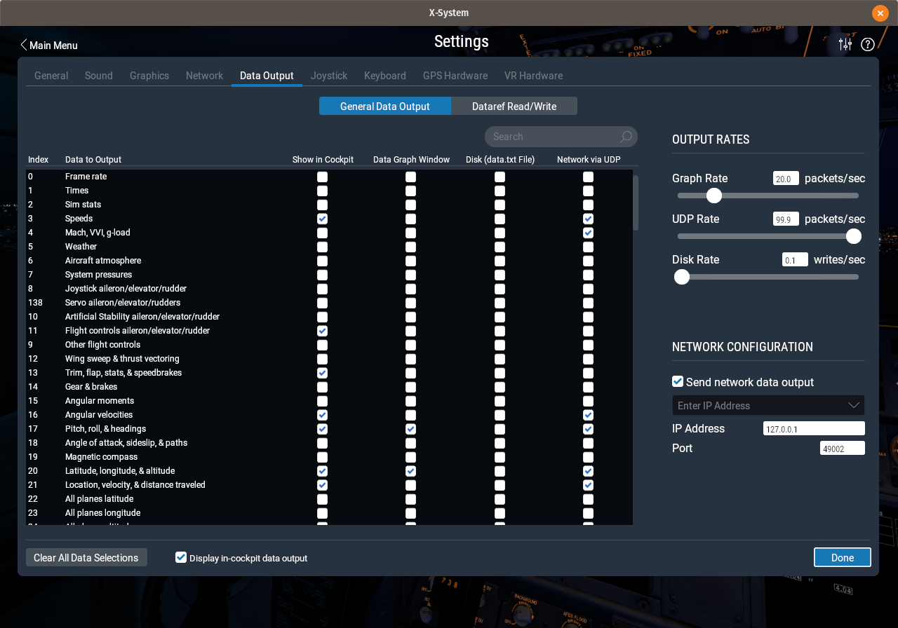

# 5a. "X" Marks the Spot

Today we're going to talk about something near and dear to my heart: **staying inside.**  
At several points in my career I have been involved with flight test programs of varying levels of sophistication and technical complexity. The biggest drawback for me was that the aircraft usually had to fly outdoors. I thought engineering was a civilized activity, but apparently there are some parts that require what basically amounts to camping in the jungle. Fortuntely for those of us that shudder at the thought of being too far from the fridge, there is a great tool we can leverage to delay those perilous journeys for as long as possible: *computer simulation*.

## 
Simulation is a tool in your arsenal that can be very useful in the right situation. In case you tend towards physical prototypes for the purpose of testing (as was often my strategy), allow me to offer a few thoughts on the subject:
* The more often you'll be testing your system, the more you'll want a simulator. The iterations are MUCH faster.
* Replicating failure scenarios is much easier with a simulator.
* Simulators make it easier to spread testing responsilibities across your team, i.e., there's no excuse for Software to send it to Test before it's been simulated.
* Do you remember "[Pilot Wings](https://youtu.be/YmEKjqgEGpE?t=534)" for Super NES? That game was so awesome.
* A simulation is only as good as the model of your system.
* If you feel like making your own simulator, maybe don't? And yeah, now you think this is some sort of cool challenge. But it's not, I promise. You've got way better uses of your time.
* At some point, no matter how good your simulator is, you will have to test your system in the real world.

The first time I attempted a fixed-wing autopilot, I used Matlab to simulate all of my path-planning algorithms. This was a huge help, and you'd think it would have dawned on me that I should test the rest of my software in a similar manner before putting it on a vehicle. Unfortunately I was still pretty new to software development, and since I didn't have any formal education on the subject, I really didn't know any better. So instead, I tested all of my low-level code on an actual vehicle. I at least had the sense to start with an [RC car](https://youtu.be/ZBo-xgQBn4E), thereby eliminating that pesky third-dimension. However I was constantly discovering bugs related to parts of the code that were being reached for the first time (oh, yeah, I also knew nothing about unit tests :dizzy_face:). So the overall test program was certainly much slower than it needed to be, although in the end I did succeed in creating a system capable of [fully-autonomous flight](https://youtu.be/7-N5IQFGF_I).

## Two rodeos is still [a very low number of rodeos](https://twitter.com/simoncholland/status/722404063678226432)
So here we are. My second attempt at an autopilot from the ground up, and thus my second attempt at testing an autopilot. One thing going for me is that I no longer live near the airport and taxiway that had proven so crucial to my tests in the past. This really forced me to find a way to simulate my testing environment. Another piece of luck is that I happened to talk to my brother shortly before I was ready to start testing. He mentioned all the cool stuff he was doing with the flight simulator [X-Plane](https://www.x-plane.com/) (he is a pilot in real life) and how capable it was in terms of third-party expansions. After some quick research it was clear that this was the perfect tool for testing my autopilot at home. **AT HOME.** The key to X-Plane's usefulness as an external simulator is its UDP data interface. 

## UDP: Yeah You Know Me
Do you like sending messages? Do you hate being left on "read"? Then UDP might be for you. If you don't know what the UDP protocol is, I will let you look it up, because if I tried to explain it here you would quickly realize that I don't know what it is either. But here's what you can do with it. There is a long list of [data messages](https://www.x-plane.com/kb/data-set-output-table/) that X-Plane will send via UDP to an IP address and port that you specify. These include handy pieces of information like roll/pitch/yaw (attitude), or latitude/longitude/altitude (LLA). Likewise you can send messages ***to*** X-Plane, such as the vehicle control inputs (aileron, elevator, rudder, throttle, flaps). This means that I could have the autopilot running on the same network as X-Plane (doesn't have to be the same computer) and the two could seamlessly interact. What's even better is that with the addition of a few interfaces, the autopilot code had no idea that it was talking to a simulator rather than being installed in a vehicle. In other words, the code isn't littered with `if (sim==true)` statements. So I was able to stress every code path that would be touched during a real flight. Hopefully there is something within this last paragraph that interests you, because we'll talking about this for a while...

## Step 1 - Let's Cheat
X-Plane messages were integrated in steps. Eventually I will demonstrate how data messages were processed and converted into fake sensor messages, and then read by real hardware. But that is several steps away. I started with a process that resembled [Test-driven Development](https://www.amazon.com/Test-Driven-Development-Kent-Beck/dp/0321146530), in the sense that I inserted a TON of duplication, and then slowly removed it. To understand what I mean by duplication, let's look at the data path for a typical estimation sensor (IMU, INS, LiDAR, etc):

The sensor is attached to physical interface, which receives its serial data, parses it, and then sends an Elixir message to the `Estimation` module. In order to fully simulator a sensor, I would need to get the data from X-Plane to travel this full path (and like I said, eventually we will). But before we do all that work, wouldn't it be nice to see if this whole X-Plane thing will even do what we want? Let's just go straight from X-Plane to `Estimation` like this:

So much easier! In order to test the autopilot I needed the following information:
* Body rates (3-axis gyroscope output)
* Attitude (roll/pitch/yaw)
* Velocity (North/East/Down)
* Position (Latitude/Longitude/Altitude)
* AGL (Above ground level, e.g., laser altimeter)

This data was available in X-Plane through messages #3, 16, 17, 20, and 21.

The hardest part was parsing the UDP messages. Here's a couple of resources I used to figure this out:  http://jefflewis.net/XPlaneUDP_9.html http://www.nuclearprojects.com/xplane/info 
Once I had the data parsed, I sent Elixir-style messages straight to the Estimation module, where it was processed as though it had come from a sensor module. Conversely, instead of sending actuation outputs to servos, I created UDP messages to send to X-Plane. Once I got those right, X-Plane treated my aileron/elevator/throttle/rudder servo commands as though they came from the pilot sitting inside the aircraft.  
If this all sounds suspicioiusly simple, IT IS! I cannot stress enough how ridiculously easy (in the grand scheme of things) it was to integrate X-Plane into my autopilot pipeline. I realize that I skipped over all the hard parts, and instead offered you some hand-waving similar to my college calculus classes that went from *"x=1, solve for x"* to **"x=y+3. Why were you born?"** in the span of a single lecture. But that's because I figure most of you aren't going to actually try this at home. If you do, please drop me a line and I'd be happy to go into more detail. And if you think this was super boring, then you'll hate the next post, because it's even more of this. I will talk about how I simulated sensor data at a low level, and also demonstrate the super basic ground station GUI that I created using Scenic. But I promise, once we're out of Sim City, we'll get back to all of my failures that happened in the real world.  
-Greg