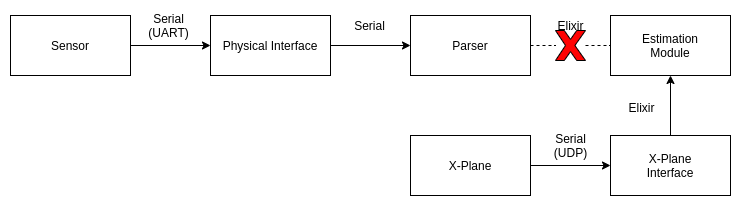

# 5b. Good HIL Hunting

If you remember from last time, we were parsing X-Plane data output messages and converting them to native Elixir messages that contained the same information. By doing this, the `Estimation` module could not tell that its data was coming from a simulator instead of a real aircraft. Here is the data path, as previously shown:

The `Estimation` module might not know the difference, but the sensor path is being totally bypassed. At some point, once we're content with the performance of our aircraft control in the simulator, we would like to stress more of the system. The next step in the progression was to take the X-plane data and create messages that conformed to the protocols of our sensors, in this case a [VectorNav VN-300 INS](https://www.vectornav.com/products/VN-300) and a [TeraRanger Evo 60m ToF (time of flight)](https://www.terabee.com/shop/lidar-tof-range-finders/teraranger-evo-60m/) sensor. Both of these sensors were connected via USB, so it was simple to spoof their presense. I replaced each of the sensors with a unique USB-to-Serial adapter, with chips such as the [CH340C](https://www.sparkfun.com/products/15096), [FT231X](https://www.sparkfun.com/products/13263), [CP2104](https://www.adafruit.com/product/3309), and [FT232RL](https://www.sparkfun.com/products/9873) (pictured below). If you're not familiar with USB-to-Serial interfaces, check out one of those boards.
[1](https://www.adafruit.com/product/3309)

By attaching a jumper between the TX and RX pins on the adapter, it's possible to send a spoofed sensor message and then "receive" it on the same interface, which is connected to the simulation computer. This message can then be parsed by the sensor module and processed as though it came from a real sensor. The data path then turns into something like this:

Notice, essentially the entire sensor path is being stressed. The only difference between this and the setup on a real vehicle is that our "sensor" messages are coming from the computer instead of a real sensor. But the messages are exactly the same, and thus the bytes are getting parsed in the exact same way. The entire setup is very compact.
[2](https://imgflip.com/i/4nw1gh)

### Don't believe me?
Here's what it takes to integrate an RC receiver, VN-300, TeraRanger Evo 60m, and Xbee radio:

The USB hub connects to the computer running X-plane, and utilizes all of the data paths that a real vehicle would require except for the `Actuation` module. But don't worry, we thought of that. Remember, that at this stage the actuation messages (aileron, elevator, rudder, throttle, flaps) are being sent directly to X-plane via UDP. But we'd really like to be driving servos, or at least pretending that we are, because the next step in our simulation is going to be running the code on representative hardware (Raspberry Pis).  Before I talk about the `Actuation` solution, let's look at the final HIL (hardware-in-the-loop) setup. First, how about a picture that includes a lot of stuff that I won't explain? :grinning: What's important is that each of those monitors in the bottom right corner is attached to a Raspberry Pi, and the Pis are connected to the Ethernet switch on the left, and thus connected to each other. 

Now that you're thorougly overwhelmed, let's zoom in on the part that's relevant for this conversation. The configuration shown here includes 6 peripherals &#8722; some simulated, some real (the actual hardware is present) &#8722; that are connected to the two Raspberry Pi nodes (off-screen to the right):
* VN-300 (simulated)
* TeraRanger Evo 60m (simulated)
* Xbee 900 MHz radio (real)
* Frsky 2.4 GHz receiver (real)
* Pololu Servo Controller 1 (real)
* Pololu Servo Controller 2 (real)

Instead of looping the sensor data back into the same USB-to-Serial adapter as with the pure simulator setup, each adapter is connected to an identical version, with the the TX and RX wires reversed.

> Sim RX -> Node TX 
> Sim TX -> Node RX 

This means the output of the simulator becomes the input to the Raspberry Pi node, i.e., the simulator is creating spoofed sensor data that is being read by the Raspberry Pis. In turn, the Pis are creating real servo commands, generated by the ungainly MUX stack at the bottom of the photo (see post #4 for more details about that). And FINALLY we can talk about the `Actuation` module. Attached to the final servo MUX is a Feather M0 board. Its job is to read the PWM outputs coming from the MUX and create a serial message that will be sent back to the simulator. This message will be read and converted to the same X-Plane control message we were using earlier to drive the ailerons, elevator, rudder, throttle, and flaps. WHICH MEANS, the `Actuation` module is being fully stressed, as it is driving real servos (or so it thinks), and the output from those servos are being used by X-Plane to control the simulated vehicle.

## In SIMpler Terms 
So what's the point? Before I ever put this autopilot in an actual aircraft, the entire software and hardware stack had been stressed, and countless bugs were found that otherwise would have been uncovered during flight test. I was able to test hardware failure scenarios ("what happens when I unplug this sensor?") and watch how the system responded (it needed some tweaks). I could also test my ground control station software using telemetry coming from actual radios (remember last time when I said I would talk about the GCS? Well, that's gonna have to wait). The HIL proved to be a tremendous resource, and is something I plan to keep updating as the design progresses.  
At this point you probably don't believe me when I suggest what we'll talk about next time, so I won't betray your trust further. But I'm leaning towards Dubins paths. I know, how did you get so lucky?? :grinning:  
-Greg