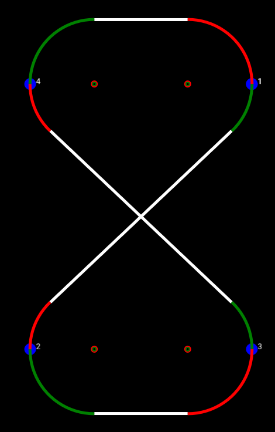

# 6. SimPATHy

For someone who keeps using the word "autopilot", I sure have avoided the autonomous part of the project for a long time. Well, hold onto your socks because today we'll be describing how the vehicle actually pilots itself. And the good news is, the explanation is quite simple:
[1](https://i.kym-cdn.com/photos/images/original/000/183/103/alens.jpg)

But how did the aliens do it? One theory is that they used [Dubins paths](https://en.wikipedia.org/wiki/Dubins_path). If you've never heard of a Dubins path, that's probably because you spent your college years with friends. Big mistake. In case you don't feel like clicking on that nicely added link, a Dubins path is essentially the shortest path between two points given a constraint on the curvature (turning radius) of the path. To create a Dubins path you just need to specify two or more waypoints, each of which includes the following information:
* 3D location (latitude, longitude, altitude)
* Heading (direction the vehicle should be headed upon reaching the waypoint)
* Speed
* Vehicle turning radius (or rate of turn)

Each segment will include a constant-radius turn, a straight line, and another constant-radius turn, as seen in this example:
[2](https://commons.wikimedia.org/w/index.php?curid=46816719)

Pretty much everything I know about Dubins paths I learned from Randal Beard's book *Small Unmanned Aircraft: Theory and Practice*. What's awesome, is that you can view the contents of the book for free on his website: https://uavbook.byu.edu. This material covers much more than just Dubins paths, and is a great resource if you are interested in aircraft autonomy. 
The unfortunate part about Dubins paths is that they involve a LOT of calculations. They aren't difficult, but there are plenty of opportunities for human error to creep in. I have rewritten these equations in 4 different languages, and I made copious mistakes every single time. So if you're going to take a shot at path planning with Dubins, be sure you have a way to quickly create and test your paths. The nice thing is that Dubins paths are pretty straight forward to display, as they do not involve any complex curvature. If you have a graphical interface that can handle straight lines and circles, then you can display Dubins paths. And if you can display them, you can find out rather quickly when you have problems.
## The Scenic View
One of the most popular libraries for creating user interfaces in Elixir is called [Scenic](https://github.com/boydm/scenic). If you don't like words without moving pictures and sound, check out the ElixirConf 2018 introduction to Scenic: https://youtu.be/1QNxLNMq3Uw. There's no doubt that Scenic is far more powerful than what I have used it for, but at the very least it's great for creating simple shapes and text and updating them on demand. Since my ground control station (GCS) pretty much only uses rectangles, circles, lines, and text boxes, it was a great fit. The first thing I created was a display to include the current vehicle information, as well as the corresponding autopilot commands.

The values in the column along the left are all the estimated values coming from the vehicle. The commands are contained in the rows on the right. This gives you a good sense of the controller pipeline: `speed`/`course`/`altitude` commands are converted to `thrust`/`roll`/`pitch`/`yaw` commands, which are converted to `rollrate`/`pitchrate`/`yawrate` commands (thrust carries over directly). This interface was useful for tuning the PID controllers in the simulator, as I could quickly compare commanded and actual values. Once the vehicle flew well under manual control (and I had a decent handle on how to use Scenic), I could get to those Dubins paths everyone's been talking about.
[3](https://imgflip.com/i/4obe5k)

The first step was to get a simple, repeatable path to display correctly. I used a racetrack with all right-hand turns. In case you didn't look at any of the required reading, there are four possible Dubins segments in regards to the turn direction for the starting and ending turns: *left-left*, *left-right*, *right-left*, and *right-right*. A right-handed racetrack only tests one of the cases: *right-right*. This is approximately not 100% of the cases. But it's a start.

You'll notice the arcs are either green or red, and there's some small circles at the center of said arcs. But this example is terrible for explaining what those are, so let's go to the next path I tried, which was an hourglass. The waypoint locations and headings are identical to the racetrack, but the order is different, which results in all of the four Dubins segments being present. 

Now for the red/green business (if you've never seen [The Red Green Show](https://www.youtube.com/user/RedGreenTV), you need to get your life together). As you recall from roughly two minutes ago, a Dubins segment is described as a turn-straight-turn. In color form, I have displayed this as green-white-red. The center of each turn arc is represented by a similarly-colored circle. If the two consecutive segments share a turn direction, e.g., a *right-left* followed by a *left-left* share a left turn, their arc centers are identical. 

I wish I had taken screenshots of all the messed up paths I was creating until I fixed the bugs in my code. I assure you it took a while. Once of the biggest ways I kept screwing up was related to my decision to keep all waypoint locations in geographic coordinates (latitude/longitude) as opposed to converting them to Cartesian coordinates (X/Y/Z). This was contrary to how I had done things in the past, so I'm sure the newness contributed to some of the errors. But I think the biggest issue was converting latitude/longitude to displacements in terms of pixels, as was necessary in order to plot the coordinates in Scenic. This is because one degree of latitude is not the same distance as one degree of longitude. Throw in the desire to create a constant margin surrounding the waypoints, and I managed to run in circles for a couple of days trying to put that darn &#8730;2 in the right spot. 
Another added bit of difficulty was that typical Dubins paths algorithms assume a constant turn radius for all waypoints. This seemed like an unnecessary constraint to me, so I reworked the equations to treat the starting and ending turn radii as separate variables. After several days of failing and crying, I understood why people just picked a single radius and stuck with it. Nevertheless, it's possible, and here is the path to prove it: 

Once I was able to create paths correctly, I added takeoff and landing points. The autopilot adjusts its path-following logic depending on the type of waypoint. For example, during takeoff, course corrections will be achieved using yaw instead of roll until the aircraft has left the ground. Flap settings are also dependent on the type of waypoint (takeoff flaps, landing flaps, no flaps for cruise). For the sake of stressing the path generator and the autopilot, I created missions at random when flying in the simulator. Below is one such path, which sort of looks like a slot car controller. I believe this is proof that aliens also have slot car technology. But that will be the subject of an entirely different series.
[4](https://i.ebayimg.com/images/g/4xYAAOSwCFhfAF05/s-l1600.jpg)

## Not all who wander are testing path following algorithms
When we take the Scenic GCS and the Scenic path planner and fly our aircraft in X-Plane, this is the view. The bottom right corner contains the terminal output, which in this case is simply showing that our cluster only contains 1 node, and therefore the cluster is complete.

Did I mention I have been able to do all of this testing with the free X-Plane demo version? Maybe if this autopilot ever makes some money I'll go back and buy a copy (look under your chair! Just kidding). But until then, we'll keep chatting about spinning copper into gold. Next time we'll look at how to replicate a VectorNav VN-300 INS for approximately 12% of the cost (and 5% of the capability, but who's counting).  

-Greg