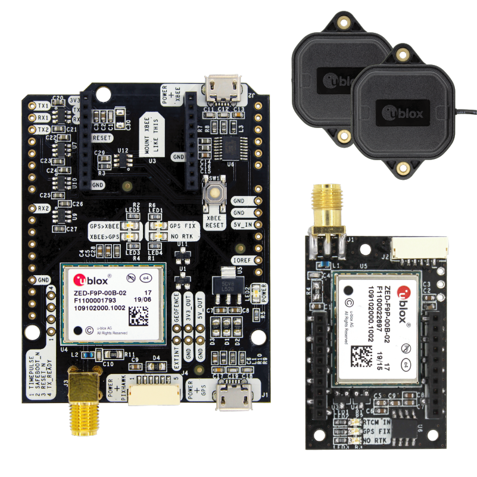

# 7. The Mimic Gimmick
What's that saying? *"Fake it until you make it."* Well today's topic goes a little something like this:
> Make it and fake it until you can afford to partake it.

For as long as there have been prototypes, there has been the question of **make vs. buy**. If you're anything like me, you're a real sucker for the **make** argument, *especially* when you actually understand how something works. But it sure is nice to just unwrap your newly acquired piece of hardware, plug it in, and get on with your life. However, sometimes that hardware is really expensive, and you're just working on some crazy idea that will likely never generate a dollar, let alone enough revenue to justify a $5,000 inertial navigation system (INS). So if the plan is to someday use a [VN-300 Dual Antenna GNSS-Aided INS](https://www.vectornav.com/products/VN-300), but our capital is currently tied up saving for a [LEGO NES Console](https://www.lego.com/en-us/product/nintendo-entertainment-system-71374?CMP=AFC-AffiliateUS-msYS1Nvjv4c-3624890-115554-1), what can we do in the meantime?
## Step 1: Make It
There's nothing terribly complicated about how an INS works. Unless you need accurate, reliable results, at which point it gets a little difficult. If there is one thing I know from experience, it's that a mediocre INS is sufficient to enable a fixed-wing aircraft to fly autonomously. In my case, "mediocre" is being extremely generous. So this thing doesn't have to be cosmic, it just needs to work reasonably well and provide consistant output. If there's one part we really want to get right, that's the inertial measurement unit (IMU). This will be give us the attitude of the vehicle (`roll`/`pitch`/`yaw`), as well as the body axes rotation rates (I usually refer to these as `roll_rate`, `pitch_rate`, and `yaw_rate`. I know this is incorrect, so if you need to scream into a pillow or something, now's your chance).
[1](https://invensense.tdk.com/wp-content/uploads/2016/06/DS-000189-ICM-20948-v1.3.pdf)

I won't get too into the weeds with the IMU, because it would all just be second-hand information at best. But two sensor breakout boards that I have been using recently are the Bosch [BNO080](https://www.sparkfun.com/products/14686) and the InvenSense [ICM-20948](https://www.sparkfun.com/products/15335). I would recommend the ICM-20948, as it is cheaper ($17), more stable, and as you will soon read, equipped with a really awesome feature.
* If you want to collect accelerometer and gyroscope data and fuse them together yourself, check out this page: https://x-io.co.uk/open-source-imu-and-ahrs-algorithms. They've got source code! You'll be up and running within a day.
* If you want to trust engineers that work on IMUs for a living, go with the ICM-20948 and utilize their Digital Motion Processor (DMP), which FINALLY has working source code available https://github.com/ericalbers/ICM20948_DMP_Arduino (HUGE shoutout to Eric Albers. I've been trying to find code like this for 5+ years). The DMP does all the sensor fusion calculations for you, so you can just get straight to the answer. I haven't flown using it yet, but so far on the bench it looks :thumbsup: 

Alright, we've got attitude and attitude_rate, now we need some position and velocity information. But first, let me point out that I am NOT using the magnetometer from the IMU to determine vehicle heading (the direction it's pointing). Remember back in the day when you had to wave your iPhone around in a figure-8 so that Google Maps knew which way you were facing? Yeah, that's because the earth's magnetic field is super weak. And there's all sorts of magnetic interference on a vehicle with electricity and moving metallic parts, so I swore off magnetometers years ago. Fortunately there is a great way to determine heading using GPS. Oh, right, I forgot to mention that we'll be using GPS to obtain position and velocity (although you probably knew this already). But wait, there's more! Actually it's just another GPS. But it's not really doing as much work.
[2](https://imgflip.com/i/4opm5k)

The basic theory behind using a dual-GPS solution to determine heading is that if you have two GPS units, you can get an accurate estimate of their position relative to each other. So if these units are attached to your vehicle at known locations, then you can determine the heading of your vehicle. Super simple, super cool. Speaking of simple (no, not you, dear reader), the company ArduSimple makes an affordable [Dual-GPS kit](https://www.ardusimple.com/product/simplertk2b-heading-basic-starter-kit-ip67/) with really straightforward integration (you're familiar with u-blox protocol, right?). And while $540 certainly isn't cheap, we're still well under our $5k baseline.

Alright, so we have data sources for attitude, attitude_rate, position, and velocity, but so far these are just measurements. In other words, they will be subject to noise and biases, and we don't want to have our state estimate jumping around from data point to data point. We need some sort of a filter. If you want to be cool, use an [Unscented Kalman Filter](https://www.seas.harvard.edu/courses/cs281/papers/unscented.pdf) (UKF). If you actually want to implement your INS, use an [Extended Kalman Filter](https://en.wikipedia.org/wiki/Extended_Kalman_filter). Now don't get me wrong, UKFs are freaking RAD. They make a ton of sense, and are clearly the better theoretical way to estimate the state of non-linear systems. But if you can find one working example that includes source code or even a detailed algorithm, then you win the internet. Conversely, EKFs are being used in several open source autopilots (Ardupilot, PX4), and thus you can look at real source code if you have the patience. The unfortunate part about most UKFs and EKFs is that they are HUGE in terms of how many states they contain. This makes debugging really difficult when you're trying to implement your first Kalman filter and have no idea where to start. So after failing several times over the past 5 years to get a 22-state EKF running, I aimed a little lower. I was able to take advantage of a Udacity "one free month" promotion, and enrolled in their Flying Car Nanodegree for the sole purpose of completing the estimation project that included a [7-state EKF](https://github.com/udacity/FCND-Estimation-CPP) (position: 3, velocity: 3, heading: 1). One of the best parts about this project was that it included a quadcopter simulator, with which you could test your EKF algorithm. I modified the EKF to use roll and pitch coming directly from my IMU (they calculate attitude in a different way), and the results looked pretty good. The final hardware stack looked like this (the Xbee radio in the bottom right is not related):

The ArduSimple sits on top of a [Sparkfun RedBoard Turbo](https://www.sparkfun.com/products/14812), which uses my favorite chip, the ATSAMD21G18 (Cheetos are second, only because I'm not exactly sure if they count as a chip). The INS code lives on the RedBoard and combines the IMU data with GPS data in the 7-state EKF, to produce the attitude, attitude_rate, position, and velocity information that we need. In case you're not familiar with the size of Arduino boards, this stack is about 3.2"x3.15", while the VectorNav VN-300 that we are emulating is 1.77"x1.73". So ours is quite a bit bigger, but I can make 8 of these for the price of one VN-300.
> Note: The RingBuffer.h file for any Sparkfun SAMD board must be modified to increase the `SERIAL_BUFFER_SIZE`. I changed it from 64 to 256. The messages coming from our u-blox can be 100 bytes, and will be dropped if the buffer is too small. That bug was really painful.
## Step 2: Fake It
Now that we've got the INS producing acceptable results, how do we integrate it with the autopilot? Because the plan is to eventually replace our stack with a real VN-300, we'd like to have that swap be as painless as possible. The easiest way to do that is to have our INS output messages that conform to the VectorNav binary message protocol. For all you datasheet lovers, here's the goods: http://rmrco.com/proj/shiprad/vn300-user-manual.pdf (VectorNav requires you to register in order to download their datasheet, which in my opinion, is really not awesome). 
At the time I was developing this INS I was fortunate enough to have access to a real VN-200 (single GPS), so I could test my message parser with a real piece of hardware. I've never understood why most message protocol datasheets don't include examples of an actual message. It's such a crucial piece of information. So if you're trying to develop your own VectorNav binary parser and need some messages to test with, drop me a line! 
## Step 3: Test It
Okay, great, so I have an INS sitting at my desk, and the `roll`/`pitch`/`yaw` looks pretty reasonable, but how the heck do I test the position and velocity algorithms without having to strap my whole desk to a truck and drive around? You guessed it. X-Plane. With the UDP data output from X-Plane, we can simulate messages that the INS would expect to be coming from the two u-blox (lowercase company names drive me nuts) GPS units. So instead of receiving GPS updates from real hardware, the INS will be getting the position/velocity from our vehicle in X-Plane, and calculating its solution accordingly. I used this same method to test my IMU algorithm: rates and accelerations go in, attitude comes out. After the bugs were worked out, our INS hardware could be fully in the loop of our X-Plane simulation. This approach proved quite successful, as the INS code required only a few tweaks when it was placed on a real vehicle. For comparison, the last time I developed an INS, I strapped down the hardware to a golf cart and drove around for days chasing all the bugs. So if you think that this current attempt is a little hacky, it used to be a LOT worse :laughing:

## Step 4: Replace It
Okay, so I'm not actually to step 4 yet, which will be when our INS wannabe is replaced by a real deal VN-300. But until then, our first three steps produced pretty good results, as proven by several flight tests. So the next time you've got $582.25 lying around, maybe think about building your own Dual-GPS INS?  

Next time we'll talk about something a little more exciting. "Impossible!" you say, as you awake from the boredom-induced slumber that can only come from something as dull as a state estimation lecture. How about something a little more universally applicable, like step-down and step-up voltage regulators and the tools we can use to monitor our batteries. Wow, it's a good thing you've got the weekend to prepare :open_mouth:  

-Greg