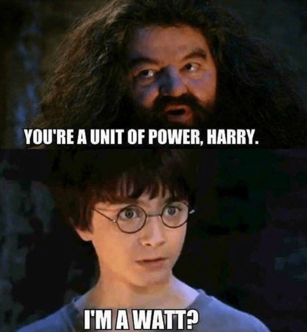
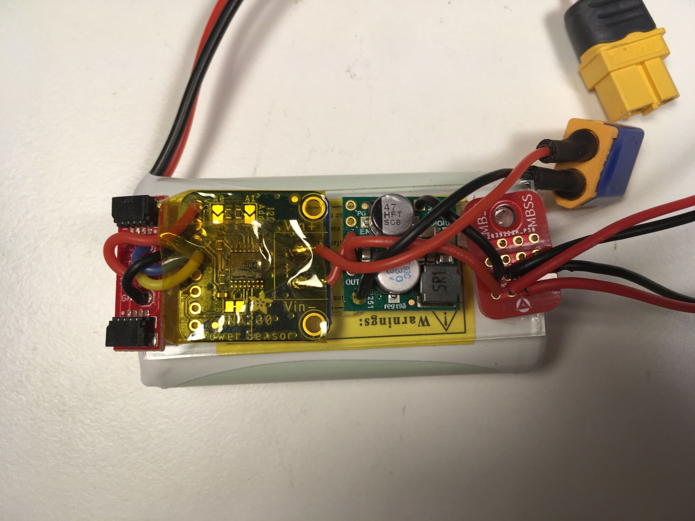
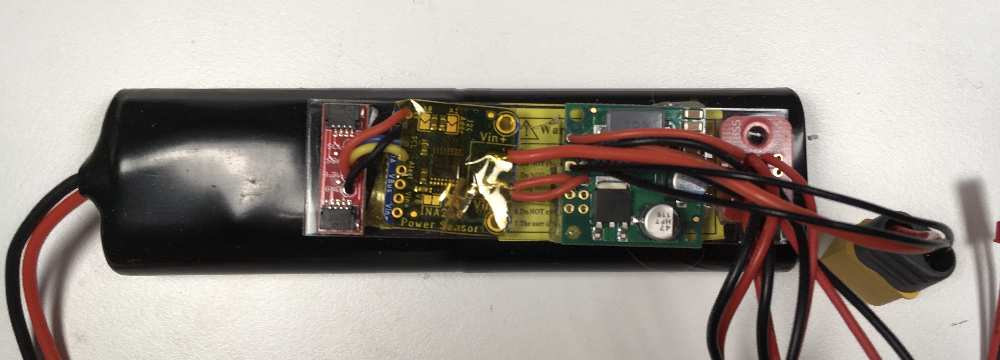
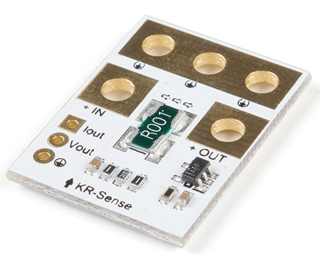
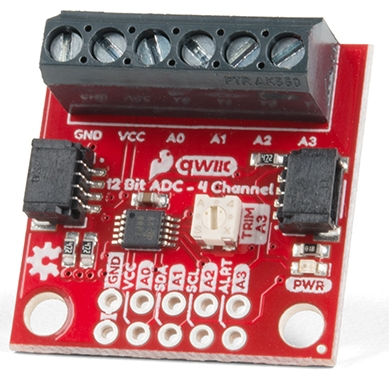
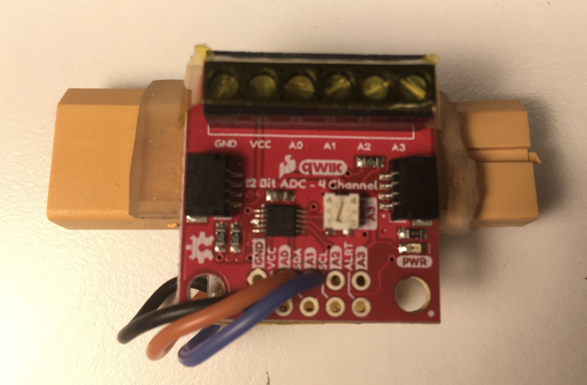
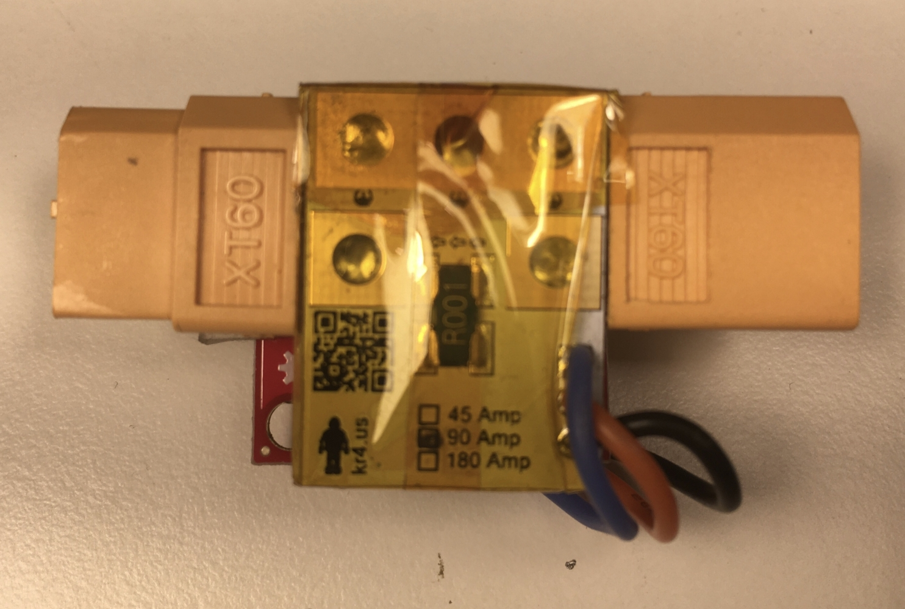

# 8. The Dolt of Volt
Throughout my career, I've had the nasty habit of holding on to preconceived notions for far too long without questioning their validity. Often times, I will let a single bad experience with a product or technology cause me to discount it for months or years, until I am introduced to it again and realize what I've been missing. Sometimes I just make a boneheaded decision up front and then live with it (one of the many dangers of working mostly alone). And thus was the case when it came to me and voltage regulators.

## Buck the trend
I don't know why, but I've got a propensity for step-down regulators. Not just, like, in general. That would be weird. But if one of my devices needs a particular voltage, I'm more inclined to use a step-down (buck) converter than a step-up (boost) converter. Honestly, I think it's just because in my mind I've managed to conflate voltage with gravity, and OBVIOUSLY it's easier to go downhill. In my defense, buck converters tend to be more efficient than boost converters for the voltage and current that I'm usually dealing with. But the different isn't huge, maybe 5-10% (and I've actually found a boost converter with essentially the same performance, so this argument has even less merit now). But let's just say that I can buck at 95% efficiency and boost at 85%. Seems like buck is the obvious choice, right? If you said yes in your head just to make me feel better, I truly appreciate it. Perhaps a little more context would help. Our Raspberry Pis require 5V to operate, and we're using batteries with lithium chemistry, so they're roughly 3.7V per cell. In other words, we're either boosting from 3.7V or bucking from 7.4V: one cell or two cells. Or, basically this:
[1](https://power.tenergy.com/tenergy-li-ion-7-4v-2600mah-rechargeable-battery-pack-w-pcb-2s1p-19-24wh-5a-rate/)

Now, the difference between one and two cells may not seems like a lot, but when it comes to aircraft, every gram counts (yeah, we're doing the metric thing, sorry for the convenience). Not only that, but if we want to increase the capacity by connecting additional cells in parallel, we will obviously need to add twice as many for the 7.4V setup. So potentially the weight penalty could be significant. And while this seems obvious in hindsight, my dumb brain was still stuck in snow day mode, and I was sledding down that hill from 7.4 to 5, having the time of my life. The whole reason for this anecdote is that in the following example I am using a 7.4V battery pack. I have since seen the error of my ways, and have switched to 3.7V, but I haven't yet put together a complete setup. So let's just say that I went to Doofus Jail, but I'm out on parole, and I see no reason why my engineering voting rights should not be restored.
[2](https://pics.onsizzle.com/youre-a-unit-of-power-harry-mawatt-25594323.png)

You know what's cool about having your battery die in the middle of a flight? Nothing. So we'd like to monitor our battery pack voltage, and for extra credit, let's get the current as well so we can calculate the energy discharged. Once again, we're using a 2-cell LiPo, so we can expect a maximum voltage of roughly 8.4V (when super-duper charged), and our Pololu [step-down regulator](https://www.pololu.com/product/3782) is capable of providing 3.2A. This means that a voltage/current sensor like [INA260](https://www.ti.com/lit/ds/symlink/ina260.pdf) from Texas Instruments will do just fine. And would you look at that? Adafruit sells a [breakout board](https://www.adafruit.com/product/4226) ready to rock. We can communicate to this sensor over I&#178;C (once we've ported their library to Elixir, of course), which will give us the battery voltage and current. Once we've added a [small protoboard](https://www.amazon.com/gp/product/B082PVGYX3) to allow for two output connections (this particular setup was powering a Pi as well as a USB hub) and attached everything to the Tenergy [LiPo pack](https://power.tenergy.com/tenergy-li-ion-7-4v-2600mah-rechargeable-battery-pack-w-pcb-2s1p-19-24wh-5a-rate/), it look like this:

That little two-sided connector on the left is a [Qwiic Adapter](https://www.sparkfun.com/products/14495) from Sparkfun that allows for I&#178;C connections using their Qwiic cables (the Adafruit equivalent is STEMMA). Both companies make a bunch of boards/sensors with this connector, making it really easy to swap devices or change the length of your cable. Once your design is a bit more polished you'll probably want to move to soldered wiring (or a PCB), but I've had good results with these connection types.  
The pack above has a 2600mAh capacity, which is plenty for a single node setup. For multiple nodes, we will also require power for the ethernet switch and router (used only assign IP addresses), so it is necessary to upgrade the voltage regulator to something a little [bigger](https://www.pololu.com/product/4091). We've also swapped the proto board for a [larger](https://www.amazon.com/MBSS-Solderable-Breadboard-Proto-Board/dp/B082PV1V6S) one, with the final result as follows. As you can see, the [battery](https://power.tenergy.com/at-tenergy-18650-7-4v-5200mah-rechargeable-battery-pack-w-pcb-2s2p-38-48wh-5a-rate/) is quite a bit bigger as well. It is also from Tenergy, and has a capacity of 5200mAh.

## Flight Ranger
So this is great for our autopilot power, but if we plan on motorin', we're going to need a battery power for our propulsion system. This will also be a LiPo pack, but the current draw will be more than the INA260 can handle. We'll be dealing in the ballpack of 24V and 60A, so something like this [KR Sense](https://www.sparkfun.com/products/16408) board will be more appropriate.
[3](https://cdn.sparkfun.com//assets/parts/1/5/1/4/1/16408-KR_Sense_90A_Current_and_Voltage_Sensor-02.jpg)

However, rather than I&#178;C, this sensor communicates using an analog voltage output. Unfortunately, the Raspberry Pi does not have any pins capable of analog-to-digital conversion, so we must employ another sensor to handle the analog readings. Sparkfun makes a handy [board](https://www.sparkfun.com/products/15334) for just the occasion, which has 4 analog inputs and uses the Qwiic connector that you've heard so much about.
[4](https://cdn.sparkfun.com//assets/parts/1/3/8/5/7/15334-SparkFun_Qwiic_12_Bit_ADC_-_4_Channel__ADS1015_-01.jpg)

The final product turns out much more compact than you'd imagine, because we solder our XT-60 battery connectors directly to the KR Sense board. After wrapping some Kaptop tape to insulate the boards and adding some [heavy duty double-sided tape](https://www.amazon.com/gp/product/B07XYYSTQB), our propulsion voltage/current sensor looks like this:

## Great Responsibility
Well there you have it, folks. I just talked about voltage regulation and current sensing for what felt like 20 minutes. And now I am *sensing* that you are bored. But next time might be more interesting! We're going to look at how we actually cram all this stuff into an airplane. You'd be amazed how quickly that darn fuselage fills up. But until then, I hope you walk around with your head a little higher, knowing that your universe can now be protected from dead batteries mid-flight.  
-Greg
[5](https://i.imgur.com/saF5rwZ.gif)
  