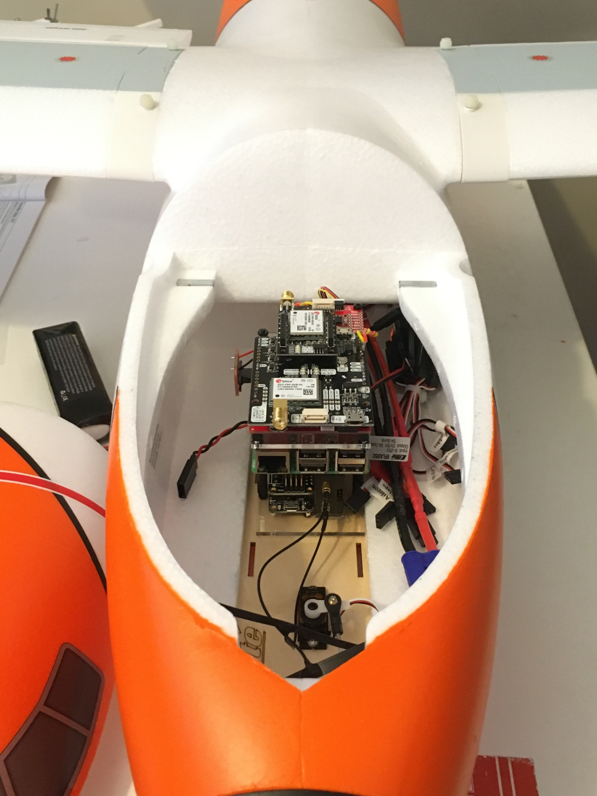
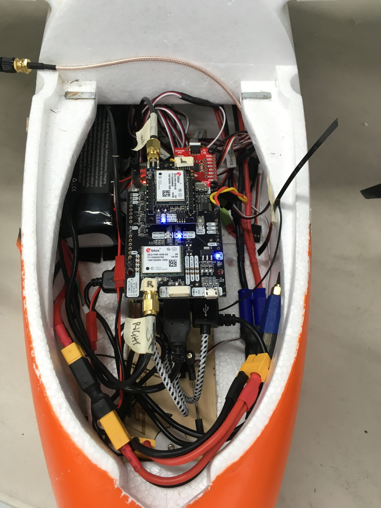
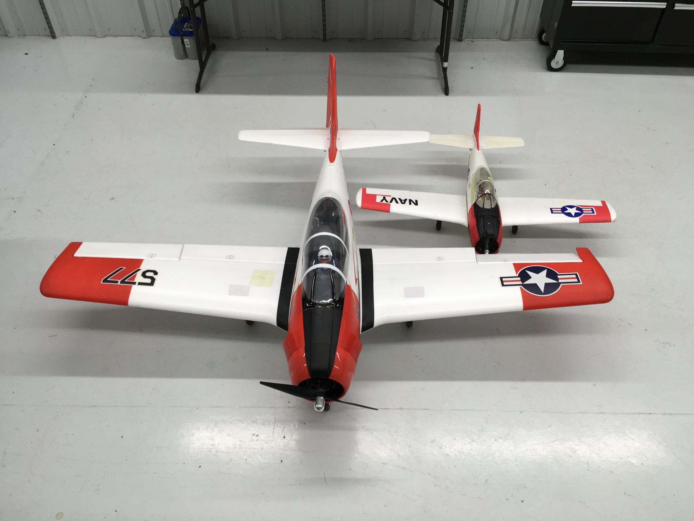

# 9. Con Air(frame)

 
I've been <del>reading</del> imagining all your feedback, and I couldn't agree more. The action movie references have really dwindled lately, and it's unacceptable. The engineering should probably take a back seat. Hey, you want to feel old? Con Air came out in 1997. Oof.  

## Airframe Integration
Alright, down to business. Today we'll be commiserating about how difficult it can be to take all your hardware from the bench and mount it in your vehicle. It's like when you see a gigantic couch at Costco that looks like it will fit in your studio apartment simply because it's surrounded by 140,000 square feet of warehouse. The mistake I make most often is forgetting that I will still need to access the hardware once it's installed. Yes, technically there might be room, but what happens when you need to replace the microSD card that is buried inside the fuselage and tucked up against a wall? This oversight cost me a TON of time, because I chose an ill-suited airframe for my first rounds of flight tests. Well, in truth, the [Horizon Hobby EC-1500](https://www.horizonhobby.com/product/ec-1500-twin-1.5m-pnp/EFL5775.html) was the wrong choice for a number of reasons, but its lack of useable internal volume was one of them. With the just the autopilot stack installed, it looks like this cockpit will have plenty of room. But once we add the flight pack and connect all the wiring, it gets really full and difficult to work with. And this was an early iteration, without the voltage/current monitoring hardware that we discussed in the previous write-up.

## Back to Basics
Your first love always holds a special place in your heart, and with RC aircraft it is no exception. My favorite airplane to fly is the [Parkzone T-28](https://www.horizonhobby.com/product/t-28-trojan-1.1m-pnp/PKZ8275.html)(sadly no longer available, unless you bought 5 of them a few years ago...:grimacing:). It is the vehicle I used for all of my first fixed-wing autopilot testing. It's light, flies great, and has lots of space on the inside for hardware. After my extremely unsuccessful tests with the EC-1500, I went back to simpler times (and [Simple Wafers wafer cookies](https://youtu.be/pCH26ZN7nkU)). One thing I realized was that in order to test most of the autopilot functionality, I did not need GPS. By removing the ArduSimple board from the INS, I could use a smaller microcontroller and greatly reduce the overall footprint. I essentially just had an IMU at this point, but it was still outputting the same VectorNav INS message, so none of the Elixir code had to change. I also replaced the separate battery module with a [Sixfab Raspberry Pi UPS](https://sixfab.com/product/raspberry-pi-power-management-ups-hat/) (uninterruptible power supply), which stacked on the Pi nicely and reduced some clutter. The resulting assembly was decently compact, and easy to install in the airplane:

Although the fit is tight on the sides, there is plenty of room in the front and the back, which is where all of the connections are made. With a custom adapter to secure the stack inside the fuselage, this setup was a breeze to handle. It enabled me to tune the gains for the rate and attitude controllers, which are the most crucial for stable flight. In other words, once the attitude controller is working well, it takes away a lot of the pilot workload, and allows the pilot to test the high-level controller with the confidence that they can fall back to attitude mode if the high-level gains are unsatisfactory.  

With the attitude controller thoroughly (barely) vetted, I was able to move on to the next airframe, which would have room for a two-node setup. Instead of jumping to that hardware right away, I took the single stack from the small T-28 and flew with this first. Despite the difference in scale, I assumed that the controller gains would be close enough to start with, which turned out to be the case. Did I mention the bigger airframe was also a T-28? The Carbon-Z series of aircraft from E-flite are fantastic, and the [2.0m T-28](https://www.horizonhobby.com/product/carbon-z-t-28-2.0m-bnf-basic-with-as3x/EFL1350.html) is no exception. It has flaps and retractable landing gear, and looks awesome in the air.

With the stack installed, we've got a ton of room.

 
## <ins>1 + 1 = 4</ins>
The tough part about connecting an additional node is that it requires equipment beyond the node itself. In order for the nodes to communicate, they must be connected via Ethernet, and each must have a IP address. For the sake of simplicity and expandability, this is currently accomplished by means of an Ethernet switch and a small router. Fortunately they both require 5V to operate, so powering them is trivial. However, that still adds two pieces of hardware once we make the leap beyond a single node. We've also reintroduced the original INS. Now the travesty in all this is that I only took picture one of the complete setup...and it's blurry. So in case you think your brain is malfuntioning due to the rat's nest of wiring, you're probably fine. However, if a fire is not struck deep within your heart after you witness Cameron Poe enjoying the sweet feeling of the wind flowing through his majestic mane, then you might want to see a doctor.

The larger airframe flew very well, despite the additional weight. I was able to validate the two-node setup (the peripherals were split between the nodes), and began tuning the high-level controller gains. At this point it was time to retire the USB connections, and move to UART communication with the peripherals, which would add robustness to both the software and hardware aspects of the design. After all, "Eliminating handshakes makes light work". But that's a story for another time.  
- Greg